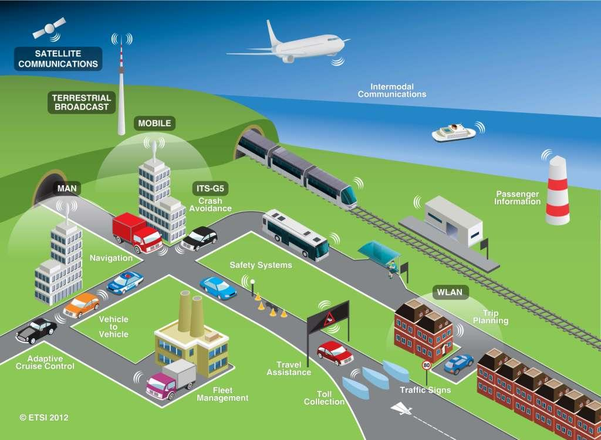

---
# Course title, summary, and position.
linktitle: ITS for Smart Mobility
summary: Learn how Intelligent Transportation Systems may help to improve the mobility of the future.
weight: 1

# Page metadata.
title: ITS for Smart Mobility
date: "2019-09-19T00:00:00Z"
lastmod: "2019-09-19T00:00:00Z"
draft: false  # Is this a draft? true/false
toc: true  # Show table of contents? true/false
type: docs  # Do not modify.

# Add menu entry to sidebar.
# - name: Declare this menu item as a parent with ID `name`.
# - weight: Position of link in menu.
menu:
  its2:
    name: Overview
    weight: 1
---

## Context

Traffic congestion on urban roads is a problem of great interest nowadays since it strongly affects security and pollution. Workforce centralization, population and economic growth alongside with continuous urbanization are the main causes of traffic congestion. As cities strive to update/expand the current infrastructures the development of Information Technologies bring new possibilities as an alternative solution for transportation systems.

The following projects aim to explore some of the new technologies used in the so called Intelligent Transportation Systems (ITS). They objective is to study to a certain level of detail some of the new traffic management systems that will conduct new ways of transportation in the XXI century. The general idea is based on the fact that information collected by sensors within traffic networks or in-vehicles sensors can collect information regarding the traffic condition, perform estimation of unknown traffic states and decide on specific actions to modify this state.

## General objective

* Identify new technologies implemented in the Intelligent Transporation Systems and investigate how these technologies are deployed in real systems.
* Define and determine adequate models that are suitable for deploying new ITS technologies.
* Develop specific solutions for ITS that can be tested under pre-defined scenarios.