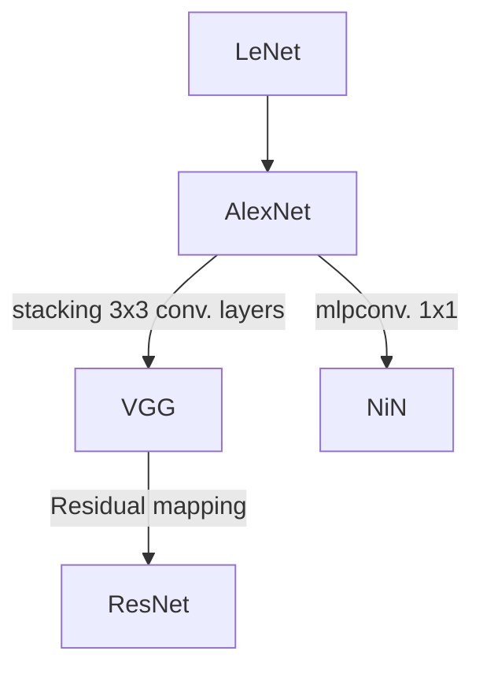

## Architectures

### LeNet 
[[link]](www.google.com)
The first CNN that uses backpropagation to practical applications.

### AlexNet 
[[link]](https://dl.acm.org/doi/10.1145/3065386)1st in ILSVR-2012. 

Popularize CNN especially in image recognition competitions.

### VGG
[[link]](http://arxiv.org/abs/1409.1556)2nd in ILSVR-2014.

A stack of 3 x 3 filter can have the same receptive field of a larger filter(a 5 x 5 filter has the same receptive field of two consecutive  of 3 x 3 filters). Using stacks of 3 x 3 conv. layers, a **deep** network is affordable because total parameters are reduced without loss of spatial resolution. VGG study encouraged later model architectures that put emphasis on depth.

### GoogLeNet (Inception Network)

1st in ILSVR-2014

Szegedy, C., Liu, W., Jia, Y., Sermanet, P., Reed, S., Anguelov, D., Erhan, D., Vanhoucke, V., & Rabinovich, A. (2014). Going Deeper with Convolutions (arXiv:1409.4842). arXiv. http://arxiv.org/abs/1409.4842
{style="color: grey"}
### Network in Network
Lin, M., Chen, Q., & Yan, S. (2014). Network In Network (arXiv:1312.4400). arXiv. http://arxiv.org/abs/1312.4400
{style="color: grey"}

### ResNet
{}
1st in ILSVR-2015
{}
He, K., Zhang, X., Ren, S., & Sun, J. (2016). Deep Residual Learning for Image Recognition. 2016 IEEE Conference on Computer Vision and Pattern Recognition (CVPR), 770–778. https://doi.org/10.1109/CVPR.2016.90
{style="color: grey"}

**Allows CNN to go deeper by solving the issue of degradation.** A deep CNN is hard to train, with empirically higher training error. This phenomenon is called the degradation of training accuracy. By adding a residual mapping from earlier to later layers, intermediate layers can learn what the model haven't yet learned ('the residuals').
### MobileNet
Using depthwise separable convolutions to reduce computation cost. Achieve comparable result to GoogLeNet and VGG-16 with significantly fewer computations

Howard, A. G., Zhu, M., Chen, B., Kalenichenko, D., Wang, W., Weyand, T., Andreetto, M., & Adam, H. (2017). MobileNets: Efficient Convolutional Neural Networks for Mobile Vision Applications (arXiv:1704.04861). arXiv. http://arxiv.org/abs/1704.04861

## Applications
### Facial Recognition
- Chopra, S., Hadsell, R., & LeCun, Y. (2005). Learning a Similarity Metric Discriminatively, with Application to Face Verification. *2005 IEEE Computer Society Conference on Computer Vision and Pattern Recognition (CVPR’05)*, *1*, 539–546. [https://doi.org/10.1109/CVPR.2005.202](https://doi.org/10.1109/CVPR.2005.202)
{style="color: grey"}
    
  Use distance based method to solve a one shot learning issue. **Siamese network,** compare the distance of learned representations to induce the semantic distance of inputs.
- Schroff, F., Kalenichenko, D., & Philbin, J. (2015). FaceNet: A Unified Embedding for Face Recognition and Clustering. *2015 IEEE Conference on Computer Vision and Pattern Recognition (CVPR)*, 815–823. [https://doi.org/10.1109/CVPR.2015.7298682](https://doi.org/10.1109/CVPR.2015.7298682)
{style="color: grey"}
  
  **Triplet Network.** Use triplet loss ( anchor vs. positive vs. negative examples ) to train the network.
### Semantic Segmantation
- Ronneberger, O., Fischer, P., & Brox, T. (2015). U-Net: Convolutional Networks for Biomedical Image Segmentation. In N. Navab, J. Hornegger, W. M. Wells, & A. F. Frangi (Eds.), *Medical Image Computing and Computer-Assisted Intervention – MICCAI 2015* (Vol. 9351, pp. 234–241). Springer International Publishing. [https://doi.org/10.1007/978-3-319-24574-4_28](https://doi.org/10.1007/978-3-319-24574-4_28)
{style="color: grey"}

  **U-Net**