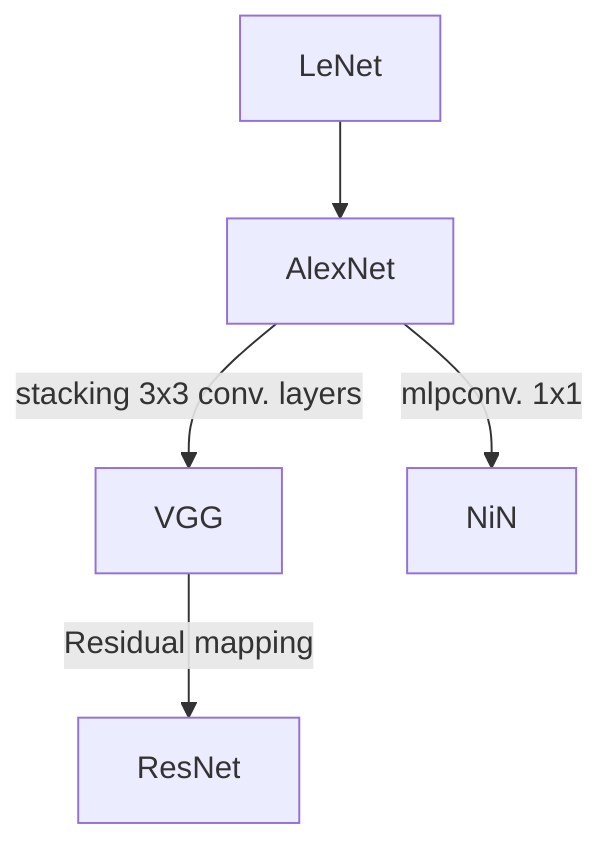

{}
This post is updated now and then, latest update 2022/11/20
{}
## Architectures

### LeNet
{}
The first CNN that uses backpropagation to practical applications.
{}
### AlexNet
{}
1st in ILSVR-2012.
{}
Brought CNN to image recognition competitions.
Krizhevsky, A., Sutskever, I., & Hinton, G. E. (2017). ImageNet classification with deep convolutional neural networks. Communications of the ACM, 60(6), 84–90. https://doi.org/10.1145/3065386 
{style="color: grey"}

### VGG
{}
2nd in ILSVR-2014.
{}
Simonyan, K., & Zisserman, A. (2015). Very Deep Convolutional Networks for Large-Scale Image Recognition (arXiv:1409.1556). arXiv. http://arxiv.org/abs/1409.1556
{style="color: grey"}

A stack of 3 x 3 filter can have the same receptive field of a larger filter(a 5 x 5 filter has the same receptive field of two consecutive  of 3 x 3 filters). Using stacks of 3 x 3 conv. layers, a **deep** network is affordable because total parameters are reduced without loss of spatial resolution. VGG study encouraged later model architectures that put emphasis on depth.

### GoogLeNet (Inception Network)
{}
1st in ILSVR-2014
{}

Szegedy, C., Liu, W., Jia, Y., Sermanet, P., Reed, S., Anguelov, D., Erhan, D., Vanhoucke, V., & Rabinovich, A. (2014). Going Deeper with Convolutions (arXiv:1409.4842). arXiv. http://arxiv.org/abs/1409.4842
{style="color: grey"}
### Network in Network
Lin, M., Chen, Q., & Yan, S. (2014). Network In Network (arXiv:1312.4400). arXiv. http://arxiv.org/abs/1312.4400
{style="color: grey"}

### ResNet
{}
1st in ILSVR-2015
{}
He, K., Zhang, X., Ren, S., & Sun, J. (2016). Deep Residual Learning for Image Recognition. 2016 IEEE Conference on Computer Vision and Pattern Recognition (CVPR), 770–778. https://doi.org/10.1109/CVPR.2016.90
{style="color: grey"}

**Allows CNN to go deeper by solving the issue of degradation.** A deep CNN is hard to train, with empirically higher training error. This phenomenon is called the degradation of training accuracy. By adding a residual mapping from earlier to later layers, intermediate layers can learn what the model haven't yet learned ('the residuals').

