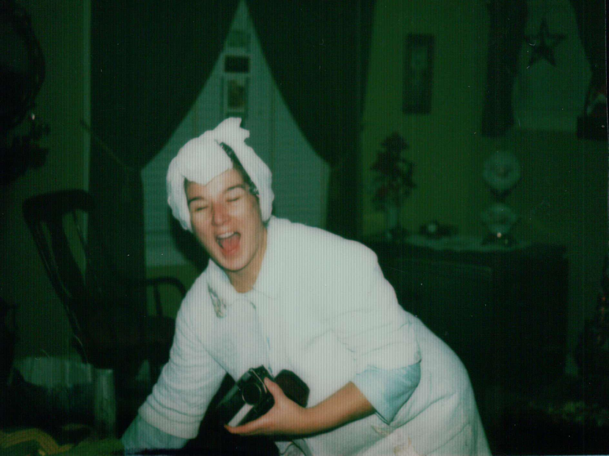

The following is in reaction to yesterday’s passing of my beloved aunt Geraldine after a half-year long battle with (what started out as) gall bladder cancer. She is very much missed and, though I couldn't be there, I believe was very well taken care of when her time came.

When I decided to write something on the loss of a loved one—both as a way of informing others of the passing of my aunt and as a way to cope with the loss, myself—I imagined it would flow easily and naturally from my fingers given what happened yesterday.

I thought, 'Shouldn't take much to produce something touching, heartfelt, poignant, and maybe a little tear-jerky. Just say how you feel.' And that's the problem. It ain’t happening.

It's not that I don't feel anything. I feel a great many things: sadness, disappointment, anger, confusion, you name it. When my father passed in 2002 it was like a punch to the gut. I was as speechless as his passing was sudden. When my grandparents (any one of them) died, it was easier as they were elderly and ‘that’s what elderly people do.’ This time around---though Jerre was in her 80s and, I suppose, in the ‘elderly’ category---after hearing a six-months-to-live prognosis given six months ago to someone who was seemingly in good health, the passing of a loved one takes on a completely different color. It becomes something that weaves itself into your calendar, that you prepare for, that you make phone calls about. It’s the first time I’ve ever thought to myself, ‘I need to make sure my phone’s charged because someone is going to die.’ Not *might*. *Is*.

At the time it seems perfectly rational. Upon reflection it feels oddly cold. This is nobody and nothing’s fault; just something I noticed.

Some of my favorite memories of my childhood center around Jerre and her home, which the family simply refers to as The Farm. At one point it was a functioning farm where they had pigs and chickens, and rows upon rows of vegetables. I can still smell the damp stone of the cellar where the walls were lined with cans of every foodstuff imaginable. The kitchen always smelled like frying meat of some sort and in the winter the wood burner would impregnate the entire house with the smell of a campfire. Jerre would insist you eat something (even if you weren’t hungry) and always put others’ needs before her own. I’d ride my four-wheeler or dirt bike all over The Farm and she’d rule over the place like a queen. It’s just how things were.

When my father passed unexpectedly, it left me and my mother alone, as my siblings (a half-brother and half-sister) are considerably older than me and were never in the ‘family unit,’ as it were. I was away at college about 90 minutes away from my family home and 60 minutes away from The Farm. Jerre’s role in my life changed slowly from being an aunt to being close to a surrogate parent, stepping in to help fill the void left by my father. She supported not just me, but my mother, as well. Our family is by-and-large pretty good at coping with loss and being alone, but it was comforting to not have to do that. Jerre, who had no children of her own and was unmarried, was there.

As the years went on, we grew closer. She got older and had trouble doing things around the house, so I (not as often as I’d liked to have, much to my regret) tried to make it over to The Farm when I could to do odd jobs, run wiring, pick up sticks in the yard, whatever she needed. The idea of her no longer being there never really crossed my mind. Jerre and The Farm were a permanent fixture in my life and there was no reason to even question that. Even after her cancer diagnosis, even during her chemotherapy, her being gone wasn’t something that seemed real or even possible. At least, not real enough to spend any energy on.

That probably falls under the category of ‘denial,’ but, I’m not a psychiatrist.

Regardless, as the end grew closer, she was in good spirits. She laughed and still bossed people around. She was even still making sure others’ needs were taken care of when she was lying on her death-bed. Then, at about 10pm on April 14th, she left us. For the week leading up she’d been surrounded by friends and family---sometimes to the point that they needed to bring in more chairs. At the end, she was there with her sister and best friend, my mother.

I hope she was happy. Our memories of her make us exactly that.

For Jerre and the millions of other people who are currently fighting, have beaten, or have lost to cancer, please consider [donating to any number of cancer charities](https://www.charitywatch.org/top-rated-charities) or, at the very least, using [Amazon Smile](http://smile.amazon.com/) whenever you buy goods online and choose from their extensive list of charities. Every bit helps.

