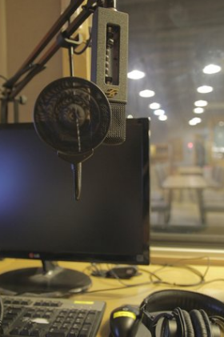

I was reading Katie Linder's Medium essay [When Do You Call Yourself an Expert](https://medium.com/@katie__linder/when-do-you-call-yourself-an-expert-f273b17a02e9#.jpz9ksg5k) on the same day that listened to her [Imposter Syndrome](http://ygtpodcast.com/ep23/) episode on the You've Got This podcast while getting ready for Faculty Forum. I don't think that's a coincidence, honestly. I mean, the timing might be but I'm clearly drawn to this topic. So, I thought I'd write up my own thoughts about it and publish them on the internet because, hey, bravery comes before confidence.

The essay reminded me of what I feel like was my first out there moment in which I was also interviewed for a podcast. Hers was for the [Teaching in Higher Ed podcast](http://teachinginhighered.com/episodes/) hosted by the wonderful [Bonnie Stachowiak](https://twitter.com/bonni208), while mine was the [Versatilist podcast](https://immersivelrn.org/resources/the-versatilist-podcast/), hosted by the wonderfully welcoming Patrick O'Shea. Like Katie, I can safely say the experience was enjoyable, there's nothing wrong with it, and I'm not unhappy with the result. To be fair, I've never actually even listened to [my Versatilist podcast episode](https://www.podomatic.com/podcasts/versatilist/episodes/2015-10-26T10_27_09-07_00) as I a) can't abide the sound of my own voice (an unfortunate state of affairs considering I teach fully online and record myself teaching upwards of 4 times a week), and b) well, precisely what I'm getting into with this piece.

When I did the Versatilist I had just begun my teaching and had only just recently graduated with my Ph.D, though I was already full-time faculty and was taking over as Program Director while the former PD was on sabbatical. Needless to say, I was a bit out of my depth and unprepared, considering I got so few chances to teach while in graduate school as I was working full time as a trainer for the University's IT department. Regardless, when I was asked to be on the podcast I thought, 'Sure, why not?' Again, bravery before confidence, right? 

So I did the podcast and I think it went fine. I enjoyed the 45-ish minutes and never really felt like I didn't know what I was talking about, but I didn't (and to a certain extent still don't) feel like an *expert* in any particular field. That's not to say I'm not working on it but I don't feel comfortable wearing the badge just quite yet. Maybe that's why I was a good fit for the Versatilist: Jack of all trades and master of none? Who knows? 

One scary thing for me was the idea that there would now be a record of me rambling on about this and that, from my doctoral research to my experience teaching as new faculty, but that anyone could access it at any time and *I couldn't be there to respond*. If I tweet something or say something in class there's an avenue for discussion, for dialog, be it synchronous or asynchronous. Being a guest on a podcast is, obviously, being interviewed and having that interview published: it's out there and that sole fact invites scrutiny. (Going on another this week, coincidentally.) So maybe it's more a fear of making a mistake and being caught out.

Anyway, one point I wanted to make in the podcast (and why we've taken this winding path) was that I think I've always been hungry for something different. I'm a neophile, a fan of novelty with a great love of the new-and-improved. That is to say, I'm always looking for more... more information, more methods, more theories, more examples, more tools. More, more, more. I'm afraid that if I ever find myself settling comfortably into the *expert* chair then that part of me could disappear, as if expertise were a destination and not a journey (to get all cat-hanging-from-a-ledge-motivational-poster for a minute). I don't want that to happen. Satisfaction is having one foot in the grave or some such.

Maybe it would help new graduates or junior faculty to see that others at the same career point are also in the same boat, confidence- or bravery-wise. It's a long road and not one that has any particular sign posts or even a decent map. We have to make our own ways, sometimes even cut our own paths^[Did you know you can buy machetes at Home Depot? They're with the gardening tools. That blew my mind. Not sure where I thought they were sold before I discovered this. Not sure I'd ever thought about where they're sold before then. It just struck me as odd.]. Maybe we get lucky enough to find a mentor that has an idea about the ditches and bumps, but that's no guarantee. Navigating all this is part of the process and, frankly, I think it's good for us. Maybe not *good*; maybe **necessary**.

Regardless, for now I think I'm most comfortable claiming that I'm on a constant path toward expertise. Maybe when I feel like I've finally claimed the prize I'll let you know. Maybe, when I'm like Katie and have two-almost-three books under my belt, I'll claim it. Until then, hi-ho, hi-ho.
