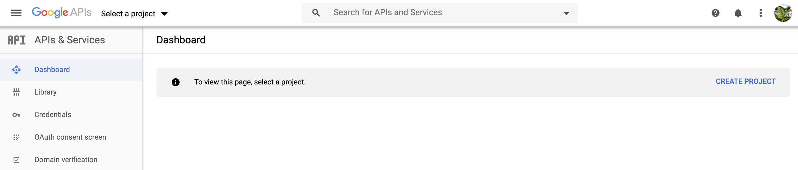
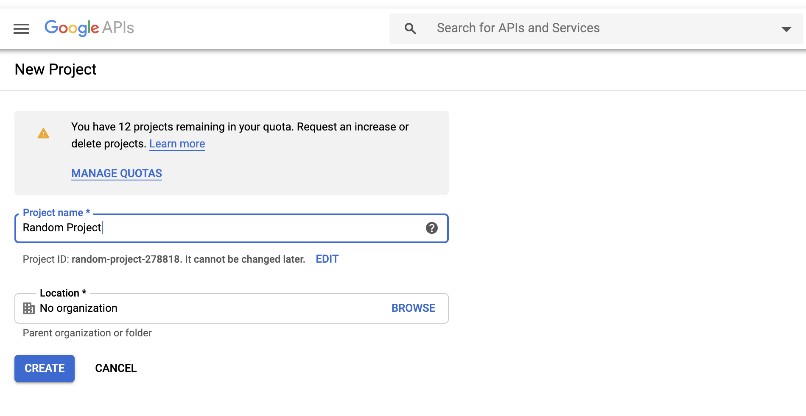
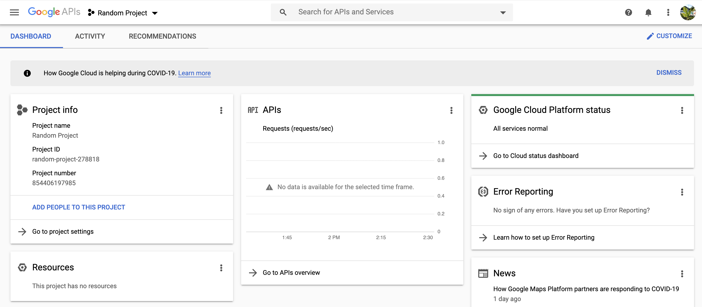
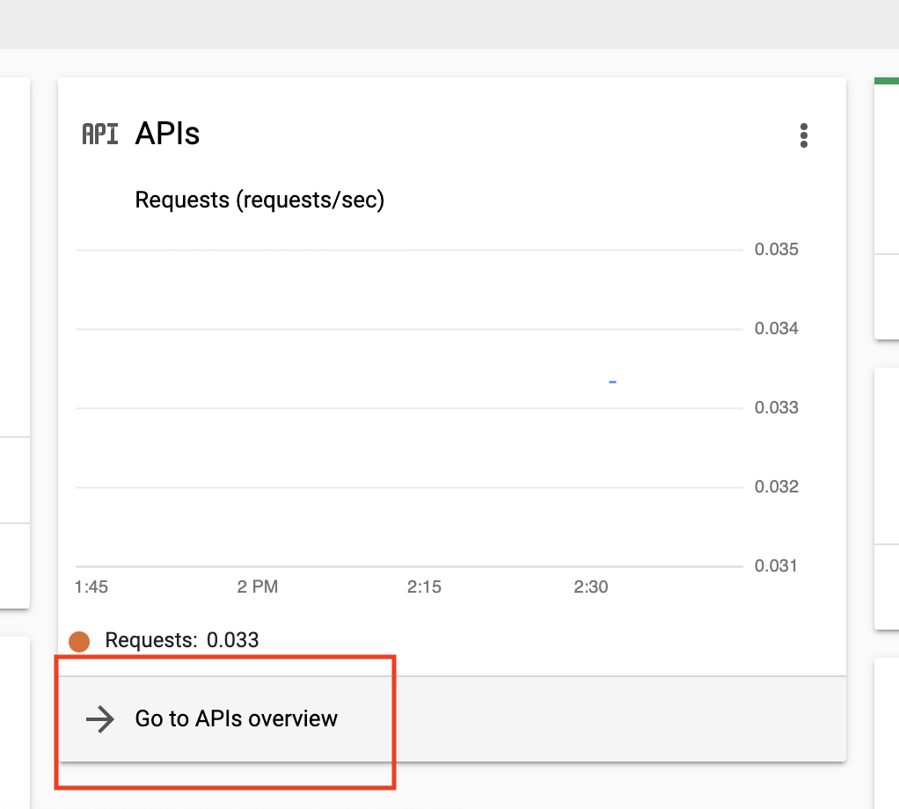
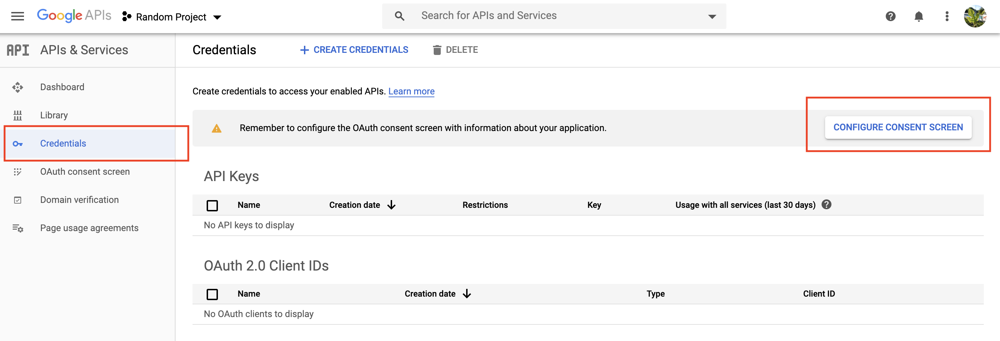
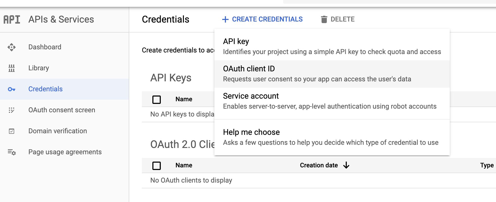
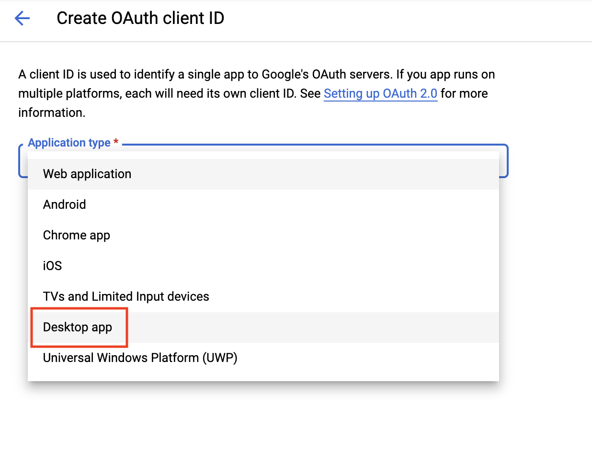

+++
title = "Using `rclone` to manage data on a remote server via Google Drive"
subtitle = "That data organization and integration you've always aspired to."

# Add a summary to display on homepage (optional).
summary = ""

date = 2020-05-30T15:25:12-04:00
draft = false

# Authors. Comma separated list, e.g. `["Bob Smith", "David Jones"]`.
authors = ['akrinos']

# Is this a featured post? (true/false)
featured = false

# Tags and categories
# For example, use `tags = []` for no tags, or the form `tags = ["A Tag", "Another Tag"]` for one or more tags.
tags = ["conda","HPC", "computing", "data storage"]
categories = ["computation", "data management"] 

# Featured image
# To use, add an image named `featured.jpg/png` to your page's folder.
[image]
  # Caption (optional)
  caption = ""

  # Focal point (optional)
  # Options: Smart, Center, TopLeft, Top, TopRight, Left, Right, BottomLeft, Bottom, BottomRight
  focal_point = ""
+++

There are a lot of reasons to set up Google Drive integration on your remote HPC system. In particular if your institution has provided you access to G Suite, there is a lot of storage available on Google Drive. Sometimes you might want to access files from multiple HPC systems, or have them at your fingertips on your local machine in addition to a remote server. This blog post will go over how to set up and use `rclone` with Google Drive on your remote server. You can learn more about `rclone` and how to use it [here](https://rclone.org/).

To get started, you'll need to have a valid Google Drive account (personal or G Suite), and you'll need to download `rclone` on your HPC server. The easiest way to install `rclone` is using `Anaconda`. You can do this by setting up a brand new `conda` environment, or by adding `rclone` to an existing environment. To create a brand new `conda` environment that you'll always use each time you `rclone`, run something like the following command:

```
conda create -n rcloneenv -c conda-forge rclone
```

And to just install `rclone` in an existing environment, type `conda install -c conda-forge rclone`. Be careful about potential dependencies! 

I had one HPC system I tried this on where the `conda` installation of `rclone` just didn't want to work. In that case, I followed these steps:

```
curl -O https://downloads.rclone.org/rclone-current-linux-amd64.zip
unzip rclone-current-linux-amd64.zip
chmod 755 rclone-*-linux-amd64/rclone
```

Which downloads the base `rclone` package using `curl`, unpacks it, and then changes the `rclone` binary to an executable file, respectively. You might want to do this in a software downloads folder, and then execute: 

```
alias rclone='rclone-*-linux-amd64/rclone'
```

And/or add the directory to `\$PATH`, using `PATH=\$PATH:rclone-*-linux-amd64/rclone', so that you can run `rclone` anywhere. Note that this is a secondary, less desirable option to just using `conda`.

Next, you'll need to run `rclone config`.

The first few steps are easy. When prompted whether you'd like to add a new remote, set a configuration password, or quit, type "n", for configuring a new remote. The next prompt will ask you for a name - this can be whatever you want. In this case, I'll enter `gdrive`. 

The next prompt asks what kind of remote this is, which should be set to "Google Drive". It's 13th on the list for me, so I enter 13. You can also just write "drive". 


The next step prompts you for a Google API Cloud ID. Getting one is not as complicated as it may sound! You'll need to go to [Google API Console](https://console.developers.google.com/) (and make sure that you're signed into the right Google account. 

First, go to Google API Console and make sure you're logged in. It should look something like the below screen, at which point you select "New Project".



Name the project whatever you like - it isn't really important. 



Next, go to your project screen:



You'll now need to navigate to the APIs Overview: 



It's tempting on this next screen to just click "Enable APIs and Services", but that's not what you want to do. Instead, head to the Credentials tab, then click "Configure Consent Screen".



This splits off momentarily if you're using a personal account vs. a G Suite account. 

## Case 1: You're using a "personal account" (no G Suite)

You need to select "External" on the consent configuration screen.

## Case 2: You're using a G Suite account

You can use "External" (more inclusive), or "Internal", if you want only users that are using an account that's part of your G Suite organization to be able to modify/move these files (for example, if I am setting this up using an @whoi.edu email account, part of the WHOI G Suite Organization, using "Internal" will limit activity to other WHOI users). External will still require that users have a Google account, and that they are going through all the steps that you have. 

The only option you need to change on the next screen is entering "rclone" for the application requesting access (though, ultimately, what you enter here is unlikely to make much of a difference.


Next, you can scroll all the way down and hit "Save", then navigate back to the Credentials tab, where you'll now select that enticing "Create Credentials" button:



And then selecting "OAuth client ID".  For "Application Type", select "Desktop app." What you name it doesn't matter.



And voilà! You now have a Client ID and a Client Secret, which you'll copy sequentially and paste into the relevant prompts back at your remote server. The next question will ask what kind of consent you want to give Google Drive. If you're interested in using `rclone` most effectively, and reading/writing/updating files, you'll need to input "drive" or 1, in order to give Google Drive full file permissions.

Now you can just hit enter a few times, to accept the default values for the following prompts:

- root_folder_id
- service_account_file
- Edit advanced config? (unless you're interested in changing upload/download speeds/chunk sizes - advanced users only!)

But **don't** use the default setting for the next prompt! It'll be tempting to just keep clicking enter, but you need to type "n" if you're on a remote server. Otherwise, the application will try to conduct authentication locally, which isn't possible unless you're using tunneling on your HPC. When you select "n", rclone will generate a link for you to visit. Select the same Google account that you used for the previous steps, and then select "Allow." 

Then, you'll get another authentication code to copy/paste. You've probably never heard about Team Drives, so unless you have, select no for the next option (or hit enter). As long as everything looks okay, go ahead and accept the new remote, then enter "q" to exit the configuration. 

One other important point is that you'll need to be connected to the Internet when you are doing you `rclone`ing. This might be a little difficult if you are using a worker node on your HPC system that doesn't have access to the Internet. Depending on your system's configuration, you may need to use the login node when you use `rclone` (which should be avoided unless your system specifically limits Internet usage to the login node). 

Now your Google Drive is hooked up to your remote server! 

```
rclone copy /path/to/local/files gdrive:files
```

Will copy files from `/path/to/local/files` locally on your HPC to your Google Drive, in the `files` folder (make sure to use the name that you entered when you configured the remote). 

If files change, either locally or on Google Drive, you can use `sync` to update them. For example, if I want to update Google Drive with my local files: 

```
rclone sync /path/to/local/files gdrive:files
```

But if I want to get the most recent Google Drive version: 

```
rclone sync gdrive:files /path/to/local/files 
```

Only the second argument is modified/updated. Happy `rclone`ing!

