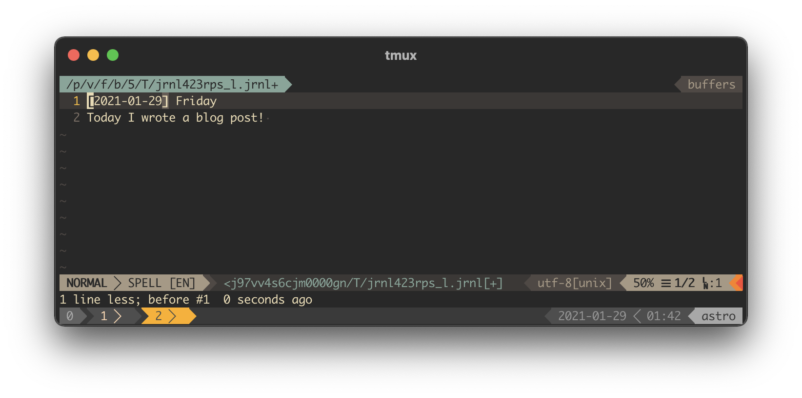

During 2020, the COVID-19 pandemic demanded routine changes from most of us. These aggravated during March 2020, when I moved to work from home. Staying confined became the new normal.

Staying at home forcefully reduced social interactions and leisure routines. I spent most of my free time at home reading, going through my IMDB watch list, and playing games. Groceries were bought online, and my limited time outdoors was used for a quick jog nearby.

By the end of the year, I was mostly [consuming information](https://medium.com/swlh/consumer-vs-producer-a-change-in-mindset-that-will-change-your-life-11cf8092e3e6). A significant change from the previous year, when I was writing my [Ph.D. thesis](https://repositorio-aberto.up.pt/handle/10216/127347). I decided to set myself some goals to ensure I kept sharp. One of them was to write more often. That was when the concept of journaling caught my interest.

### Journaling
[Journaling](https://en.wikipedia.org/wiki/Diary) is the act of frequently recording personal thoughts and life events. When done daily, it is often called a diary. While journaling, one forces herself to reflect on daily life.

The oldest reference to journaling dates back to the 2nd century, with the Roman Emperor Marcus Aurelius's work, [Meditations](https://en.wikipedia.org/wiki/Meditations). In it, Aurelius recorded his private notes, as well as reflections on stoic philosophy. A more recent and well-known example is Anne Frank's [The Diary of a Young Girl](https://en.wikipedia.org/wiki/The_Diary_of_a_Young_Girl), wrote while hiding in Amsterdam during the second world war German invasion.

Nowadays, people keep journals for the most varied reasons: track their diet, sleep, travels, reflect on their day, or coping with a challenging life event. Many argue that journaling can provide a [positive influence on mental health](https://dailystoic.com/journaling/).

So, starting this year, I've decided to experiment with journaling.

### Using jrnl
I wanted to use journaling for a daily retrospective and tracking progress on yearly and monthly goals. I needed a digital solution that would allow me to search my entries. [jrnl](https://jrnl.sh/) fits those needs.

`jrnl` allows me to edit my entries on my editor of choice within my terminal. The project is open source and uses a plain text file to keep the journal entries, ensuring I could move them to another format if needed. After going through the documentation, I've customized it with:
```yaml
editor: nvim -c "set spell"
journals:
  default:
    encrypt: true
    journal: /path/to/dropbox/file
timeformat: '%Y-%m-%d'
```
The first line sets Neovim as the default editor with spell check active. The second stores my journal file on Dropbox, encrypted. Finally, I've changed the date format to exclude time, as I only want to have one entry per day.

I wanted to quickly create entries for today and yesterday. Also, I needed to access my goal-setting entries on the first of each month and year. Using the [fish shell](https://fishshell.com/), I have created a set of functions and aliases to do so.

```fish
function jrnl_create_or_edit
  # Check if entry exists
  set -l entry_size (jrnl -on "$argv[1]" | wc -l)
  if test $entry_size -eq 1
    jrnl "$argv[1]: $argv[2]" # Create entry if it doesn't exist
  end
  jrnl --edit -1 -on "$argv[1]" # Open entry in editor
end

alias jd="jrnl_create_or_edit (date +\"%Y-%m-%d\") (date +%A)"
alias jy="jrnl_create_or_edit (date -v-1d +\"%Y-%m-%d\") (date -v-1d +%A)"
alias jm="jrnl_create_or_edit (date +\"%Y-%m-1\")"
alias jyy="jrnl_create_or_edit (date +\"%Y-1-1\")"
```

The `jrnl_create_or_edit` function creates an entry for a given date, if it doesn't exist yet, and opens it using my editor. The aliases `jd`, `jy`, `jm`, and `jyy` use this function to edit an entry for today, yesterday, the first of the month, and the year. Saving the file in the editor writes this entry to my `jrnl` file. Editing an entry looks like this:



### Conclusion
Reflecting on my daily activity helps me rethink where I should be putting my personal and professional time. It also allows me to recognize the small wins one has during the day, which are invaluable when confined for almost a year.

It is still early to evaluate how positive journaling will be for me in the long run, or even if I will stick to it. So far, I find it rewarding and am motivated to keep doing it.

My journaling setup was inspired by [21st Century Journaling for Developers](https://medium.com/@mntlmaxi/21st-century-journaling-for-developers-f3a1c2a8eb4e).
