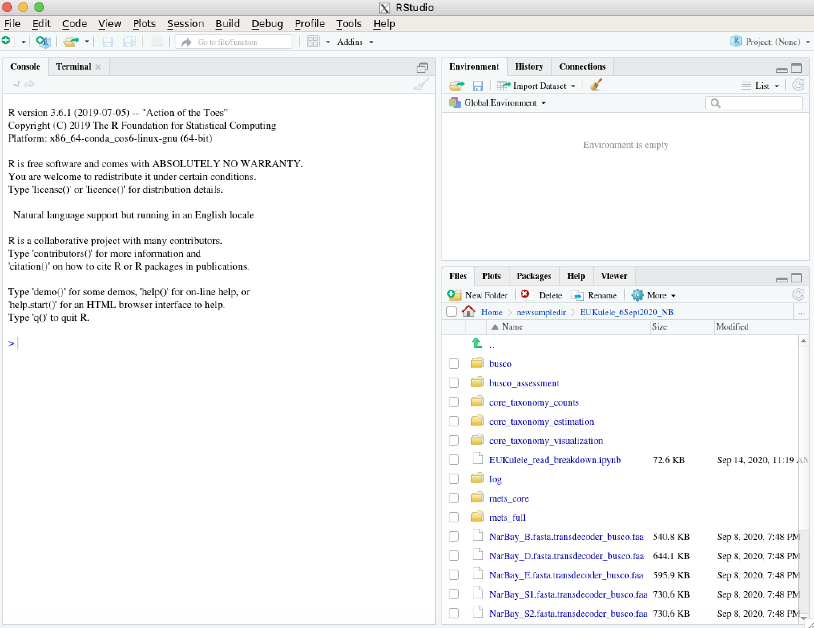

+++
title = "`XQuartz` and remote integration for RStudio"
subtitle = "Reuniting with your long-lost IDE."

# Add a summary to display on homepage (optional).
summary = ""

date = 2021-03-17T10:11:12-04:00
draft = false

# Authors. Comma separated list, e.g. `["Bob Smith", "David Jones"]`.
authors = ['akrinos']

# Is this a featured post? (true/false)
featured = false

# Tags and categories
# For example, use `tags = []` for no tags, or the form `tags = ["A Tag", "Another Tag"]` for one or more tags.
tags = ["conda","HPC","computing","R","RStudio"]
categories = ["computation", "data management"] 

# Featured image
# To use, add an image named `featured.jpg/png` to your page's folder.
[image]
  # Caption (optional)
  caption = ""

  # Focal point (optional)
  # Options: Smart, Center, TopLeft, Top, TopRight, Left, Right, BottomLeft, Bottom, BottomRight
  focal_point = ""
+++

`RStudio` was once my favorite and most often-used IDE. And there are still a lot of reasons to use it, even if you've gotten used to something like `Spyder` or `Jupyter`. `RStudio` is a clean IDE that allows you to simultaneously view your filesystem, environment variables, `R` scripts, and console, and is all very specifically tailored to `R`, which is important in many cases (`R` is an amazing but finicky language). There are many occasions when doing "big data"-esque work on an HPC in which you may need access to an IDE. The perhaps most frequent situations are visualizing/exploring data and debugging.

For this tutorial, you'll need a few things. The first thing is the most important, and it's a little bit out of your hands. Your HPC system needs to be set up for X11 forwarding, which is a way to access the graphical window being spun up by the remote system (with access to all the files on that system) on your own computer. So we're taking the visual output that the HPC can generate but doesn't have the display to visualize, and sending it somewhere on our own computer. Namely, we'll use `XQuartz` to visualize this incoming data stream, which is the second prerequisite. 

The `X11`-related software you'll need on your computer differs based on whether you are a Mac or a PC. [This website](https://kb.thayer.dartmouth.edu/article/336-x11-for-windows-and-mac) contains links to both. If you're on Mac, you'll need to download `XQuartz`, and if you're on PC, it'll be `Xming`. 

The third prerequisite is that you need `RStudio` installed somehow on your HPC system. My preferred method of doing this is via `conda`. While we're at it, we should also install some dependencies that will come up in your use of `R`. Once you have `conda` set up, you can use the following command to set up an `R` environment that should work: 

```
conda create -n myRenv -c r r-essentials r-base rstudio r-lattice
```

Okay, now that we're through the prerequisites, we can start setting up an `RStudio` window on our remote HPC. First, try logging into your remote HPC with `XQuartz` enabled, like so:

```
ssh -v -X <your username>@<your HPC address>
```

If you're not used to using the `-v` (verbose) flag when you log in, this will be an unwelcome spam to your screen. But the reason I suggest this is that you can sift through all of that noise to look for a line that looks something like this:

```
debug1: Requesting X11 forwarding with authentication spoofing.
```

So that you know your HPC system indeed is set up for `X11` forwarding and isn't just ignoring the flag you offered it. 

Next, we want to set up a compute or interactive node that we can use for long enough to get our work in `RStudio` finished. This may differ system-to-system. If you're using SLURM, you can use a command like this: 

```
srun --time=<some time limit> -p <queue to use> --mem=<some memory requirement> --pty bash
```

Once you're allocated resources, you should see a prompt that displays the new node you've been redirected to. Next, you'll type `exit` into the window to leave this node and return to your original node (most likely the login node). This is because we need to log into this new node that we reserved with that `-X` flag, in order for it to recognize our request to use `X11` forwarding. So, remembering the node that you were dispatched to, type:

```
ssh -X <your user>@<your new node>
```

(Depending on your present location, you might not need the username). Now, we can activate that `conda` environment that we prepared before getting started. 

```
conda activate myRenv
```

Which should make `RStudio` available to you. Now, we're ready to launch `RStudio`! Your `XQuartz` or `Xming` window should pop up for you automatically when you type:

```
rstudio --x11
```

You may also see this output in your terminal:

```
debug1: client_input_channel_open: ctype x11 rchan 3 win 65536 max 16384
debug1: client_request_x11: request from 127.0.0.1 46360
debug1: x11_connect_display: $DISPLAY is launchd
debug1: channel 1: new [x11]
debug1: confirm x11
```

Which is good. In your `XQuartz` application, you would see something like this:



Note that if the window doesn't pop up, you can just select the `X` [marks the spot] in the taskbar to find your instance of `XQuartz` or similar, where your `RStudio` window should be patiently waiting, assuming you didn't get any errors. 


