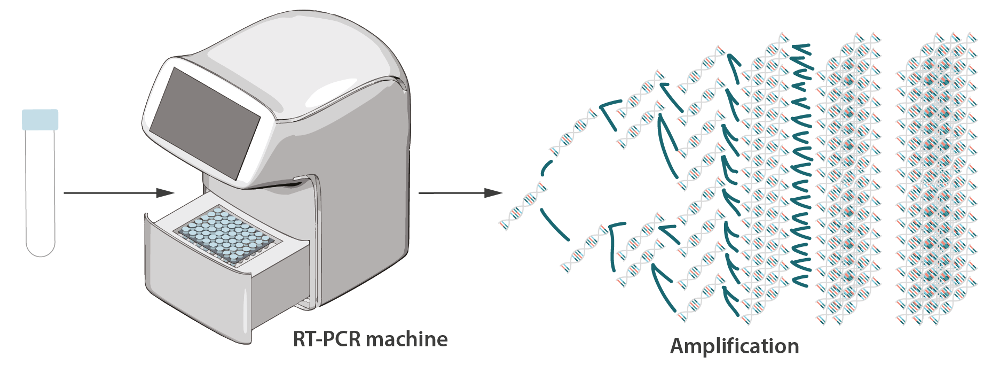
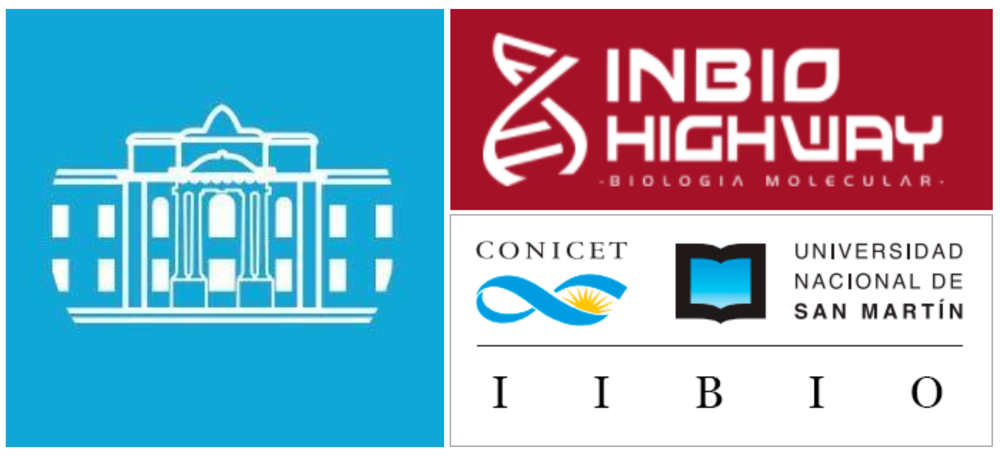

# ¿En qué estábamos pensando?

Como parte de la convocatoria extraordinaria Ideas-Proyecto COVID 19 impulsada por el Ministerio de Ciencia y Tecnología y la Agencia de Promoción Científica y Tecnológica, presentamos un proyecto que apuntó fundamentalmente a la generación de soberanía tecnológica en el campo diagnóstico. Se supo desde el comienzo de la pandemia que tanto el costo como la disponibilidad de los reactivos se volverían un problema para satisfacer la demanda. La mayor parte de los kits con los que se contaba (al momento de presentar el proyecto) eran de importación; lo que suponía no solo una erogación cuantiosa de divisas sino además la posibilidad de que estos reactivos escasearan ante una demanda global pujante.

Con esto en mente nos propusimos cubrir parte de la demanda mediante el desarrollo de un para la purificación y detección in vitro de ARN de SARS-CoV-2, en particular, pero apuntando a generar un recurso versátil. Queríamos que este desarrollo perimitiera no solo dar respuesta al problema inmediato sino también dotara al sistema de conjunto de herramientas de biología molecular de alta calidad, a bajo costo, de producción nacional; con aplicaciones genéricas.

El día 27 de abril se publicaron los resultados de la convocatoria con la lista de propuestas financiables y, afortunadamente ¡El proyecto presentado salió seleccionado!  

# ¿Y de qué va el kit?

## Antes que nada...

Un elemento fundamental en el proceso de diagnóstico es nada menos que la extracción de genoma viral a partir de hisopados orofaríngeos. Para esto se comercializan kits con distintos niveles de complejidad (incluso algunos de ellos totalmente automatizables con el equipamiento adecuado). Independientemente de cuán simples o complejos sean, estos kits tienen el único fin de obtener ARN (genoma viral) purificado a partir de un hisopado.

## RT-PCR

Para detectar al SARS-CoV-2 existen, a la fecha, varias metodologías. La técnica _gold standard_ (es decir, la técnica de referencia) es la **RT-PCR** (del inglés, *RetroTranscription - Polymerase Chain Reaction* o *Retrotranscripción seguida de Reacción en cadena de la polimerasa*). Esta técnica involucra la **conversión del genoma viral (ARN) en moléculas de ADN**, y la **multiplicación específica de esas moléculas de ADN** al punto en que la cantidad de moléculas es tan grande que se pueda *"ver"*. 

_Imagen extraída del [Internationa Atomic Energy Agency](iaea.org/bulletin/infectious-diseases/how-is-the-covid-19-virus-detected-using-real-time-rt-pcr)_

"Ver" así, con comillas, porque en realidad no es posible **ver** estas moléculas al ojo desnudo. Para ello se utilizan equipos y reactivos de detección especiales. Estos reactivos se llaman *sondas* y cumplen la función de fluorescer (¡brillan!) cuando la reacción de amplificación ocurre. Como la reacción **solo ocurre** cuando la muestra **tiene virus**, el reactivo **solo brilla** cuando la muestra pertenece a un paciente infectado y, por lo tanto, hay partículas virales en ella.

# ¿Y qué compone un kit de RT-PCR?

Un kit de detección por RT-PCR está compuesto por:

- Una mezcla de reacción
- Un conjunto de enzimas
- Un combo de *primers* y *sondas* específicos de uno o más pedacitos del genoma viral
- Un *control positivo*

La mezcla de reacción contiene un conjunto de sustratos para que las enzimas hagan su trabajo así como también elementos estabilizantes que permiten a las enzimas trabajar de la forma más eficiente posible. Las enzimas son catalizadores biológicos... nanomáquinas que aceleran miles de millones de veces una reacción química específica. 

Como dijimos, la reacción involucra dos pasos: la conversión de ARN a ADN y la subsiguiente multiplicación de las moléculas de ADN. El primer paso necesita de una enzima llamada **retrotranscriptasa**, un **componente fundamental de cualquier kit de detección por RT-PCR**. En el segundo paso, interviene fundamentalmente una enzima llamada **ADN polimerasa**. Los **primers** son el punto de partida a partir de los cuales ambas enzimas comienzan su trabajo; mientras que las **sondas** sirven, como dijimos más arriba, para saber si la reacción está ocurriendo. Por último, el **control positivo** es una molécula de ARN que, si todo salió bien en la reacción, tiene que dar señal. Si esto no ocurre, el experimento ha fallado y ninguna de las pruebas diagnósticas puede considerarse válida. 

# Aportes propuestos 

El proyecto planteó la posibilidad de producir localmente tres piedras angulares del diagnóstico por RT-PCR: 

- El kit de extracción de ácidos nucleicos
- Las enzimas para para RT-PCR
- La mezcla de reacción para RT-PCR

# El grupo de trabajo

El equipo de [@trypanosomatics](/authors/trypanosomatics/) es más bien pequeño pero ya contábamos con experiencia en producción de enzimas recombinantes ([@Emir Salas-Sarduy](/authors/emir/)) y en el desarollo y puesta a punto de mezclas de reacción para qPCR ([@Lionel Uran L.](/authors/lionel)). Desde el comienzo supimos que esto no sería suficiente, por lo que para encarar este ambisioso objetivo nos asociamos con [INBIO Highway](https://www.inbiohw.com.ar/), una empresa de base bioctecnológica radicada en Tandil; y con el [Instituto ANLIS Malbrán](http://anlis.gov.ar/). Estas alianzas serían fundamentales para el escalado y la validación de los desarrollos. INBIO Highway, además, ya comercializaba un kit de extracción de ácidos nucleicos (y estaba trabajando en la adaptación del mismo para su uso en purtificación de ARN viral); y producía comercialmente la ADN polimerasa.

# Manos a la obra

---- No sé bien cómo contar los resultadods... ideas? 