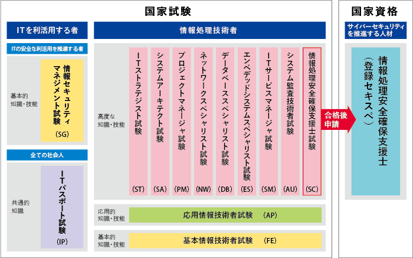

# はじめに

この記事は主に大阪府立大学現代システム科学域知識情報システム学類に所属している学生に向けて、基本情報技術者試験の勉強を推奨するものです。

# 時間がない人向け要約

基本情報技術者試験の勉強をすると大学の授業内容を分かりやすく先取りできるから成績上がるぞ。オススメ。

# 情報処理技術者試験とは

情報処理技術者試験は、[IPA(情報処理推進機構)の公式サイト](https://www.jitec.ipa.go.jp/1_08gaiyou/_index_gaiyou.html)で以下のように説明されています。
>情報処理技術者試験は、「情報処理の促進に関する法律」に基づき経済産業省が、情報処理技術者としての「知識・技能」が一定以上の水準であることを認定している国家試験です。
>
>情報システムを構築・運用する「技術者」から情報システムを利用する「エンドユーザ（利用者）」まで、ITに関係するすべての人に活用いただける試験として実施しています。特定の製品やソフトウェアに関する試験ではなく、情報技術の背景として知るべき原理や基礎となる知識・技能について、幅広く総合的に評価しています。

 
簡単に言いますと情報系の国家試験です。そして情報処理技術者試験の一区分として、今回私がその勉強を推奨する基本情報技術者試験があります。
 

[IPA 試験区分一覧](https://www.jitec.ipa.go.jp/1_08gaiyou/_index_gaiyou.html)
https://www.jitec.ipa.go.jp/1_08gaiyou/_index_gaiyou.html

# 基本情報技術者試験とは

基本情報技術者試験とは、情報処理技術者試験の一区分です。
難易度としては四段階中の二段階目として設定されており、ITエンジニアの登竜門とされているようです。 

>１．対象者像 
>高度IT人材となるために必要な基本的知識・技能をもち、実践的な活用能力を身に付けた者 
>２．役割と業務 
>基本戦略立案又はITソリューション・製品・サービスを実現する業務に従事し、上位者の指導の下に、次のいずれかの役割を果たす。 
>　(1) 需要者（企業経営、社会システム）が直面する課題に対して、情報技術を活用した戦略立案に参加する。 
>　(2) システムの設計・開発を行い、又は汎用製品の最適組合せ（インテグレーション）によって、信頼性・生産性の高いシステムを構築する。また、その安定的な運用サービスの実現に貢献する。 

[IPA 基本情報技術者試験](https://www.jitec.ipa.go.jp/1_11seido/fe.html)
https://www.jitec.ipa.go.jp/1_11seido/fe.html

# 基本情報技術者試験の勉強をオススメする理由

理由はシンプルで、知識情報システム学類の専門科目の内容が基本情報技術者試験の内容と被るところが多いからです。このため基本情報技術者試験の勉強は、新入生にとって専門科目の良い予習となり、在学生にとっては専門科目の良い復習となります。 

私は二年生の後期から基本情報技術者試験の勉強を始めましたが、その内容は大学の専門科目の範囲と重なる部分がとても多く、良い専門科目の予習と復習になりました。また大学の教科書よりも基本情報技術者試験の参考書の方が分かりやすかったため、大学の授業中に基本情報技術者の参考書を開くことも少なくありませんでした。

# 合格体験記

私が基本情報技術者試験の受験を決めたのは二年生の後期のことでした。受験の理由としては、情報系の学生としてある程度の知識があることを、就活などにも使える資格という分かりやすい形で示したかったからです。 

受験を決めてからまず基本情報技術者試験についてインターネットで簡単に調べました。[IPAの公式サイト](https://www.jitec.ipa.go.jp/1_08gaiyou/_index_gaiyou.html)、Qiitaの記事、合格者のブログなどを読んでおおよその試験の概要を理解した後、書店に行き参考書を選びました。とにかく分かりやすさを重視したため「キタミ式イラストIT塾 基本情報技術者」に決めました。 

まずはそこそこの分厚さのある参考書を内容の理解は完全でなくとも読み進めることを重視して一周読み、その後分かっているところは軽く流しつつ分からなかったところをインターネットや学校の教科書でしっかり調べてもう一周読みました。 

そして大体どの分野の内容がどのあたりのページに書いてあるかが理解できる程度に参考書を読めたところで、[基本情報技術者試験ドットコム](https://www.fe-siken.com/)で午前問題の過去問演習を始めました。 

午前の過去問は直近十回分やりました。そして安定して八から九割の正答率を出せるようになったところで午後の過去問に取り組みました。 

午後の過去問は選択問題がいくつかあるのですが、自分がどの分野が得意なのかを見定めるために全問問いていました。そして正答数の統計を取りながら最新の回を除く過去七回分を終えたところで自分の得意分野を絞り、最後に最新の回を本番と同じ環境で選択問題として解きました。 

後は本番に向けてコンディション整えて受験に挑み、合格する事が出来ました。 

私は試験勉強をしている時何度も挫けそうになりました。しかしそんな時いつも私を支えてくれていたのはこのアプリNaviでした。勉強して分からないところがあればいつでも何でも優しく教えて下さった先輩と、一緒に勉強をしてモチベーションを高めあってくれた同輩がいたからこそ私は合格することが出来たのだと思います。きっとアプリNaviに入っていなければこの試験の存在すら知ることは無く灰色の大学生活を送っていたでしょう。アプリNaviに入ってから成績は上がり、友達は増え、彼女が出来ました。アプリNaviこそ私の大学生活に必要だったものだと、今なら胸を張って言うことが出来ます。この記事を読んだ皆さんがアプリNaviで共に理想のキャンパスライフを送れることを祈っています。

# おわりに

主に知識情報システム学類の学生に向けて書いていましたが、勿論その学生でなくても、少しでもプログラミングやアプリ開発に興味がある人ならば勉強して決して損はない基本的なITの内容になっています。なんでしたら参考書だけ買って受験はせずにそれを読むだけでも大分役立つと思います。 

アプリNaviに入れば合格者の先輩方が優しく教えて下さいます。アプリNaviに入りましょう。
