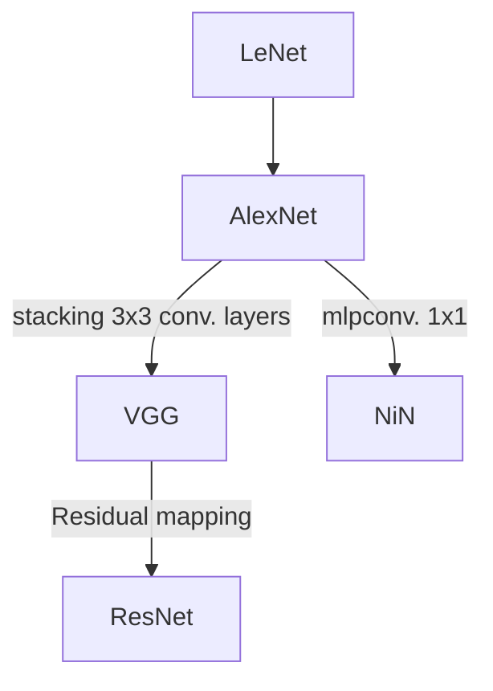

## Architectures

### LeNet

### AlexNet
Krizhevsky, A., Sutskever, I., & Hinton, G. E. (2017). ImageNet classification with deep convolutional neural networks. Communications of the ACM, 60(6), 84–90. https://doi.org/10.1145/3065386 
{style="color: grey"}

### VGG
Simonyan, K., & Zisserman, A. (2015). Very Deep Convolutional Networks for Large-Scale Image Recognition (arXiv:1409.1556). arXiv. http://arxiv.org/abs/1409.1556
{style="color: grey"}

### GoogLeNet (Inception Network)
Szegedy, C., Liu, W., Jia, Y., Sermanet, P., Reed, S., Anguelov, D., Erhan, D., Vanhoucke, V., & Rabinovich, A. (2014). Going Deeper with Convolutions (arXiv:1409.4842). arXiv. http://arxiv.org/abs/1409.4842
{style="color: grey"}
### Network in Network
Lin, M., Chen, Q., & Yan, S. (2014). Network In Network (arXiv:1312.4400). arXiv. http://arxiv.org/abs/1312.4400
{style="color: grey"}
### ResNet
He, K., Zhang, X., Ren, S., & Sun, J. (2016). Deep Residual Learning for Image Recognition. 2016 IEEE Conference on Computer Vision and Pattern Recognition (CVPR), 770–778. https://doi.org/10.1109/CVPR.2016.90
{style="color: grey"}

