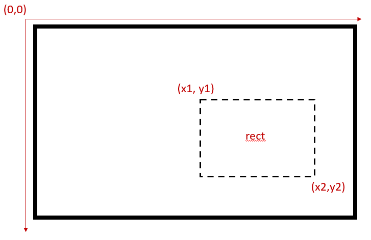
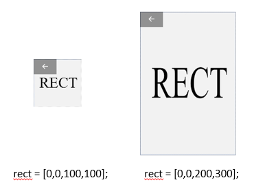

## TL;DR
```python
img = imread('img.png'); 
Texture = Screen('MakeTexture', window, img);
rect = [x1, y1, x2, y2];
Screen('DrawTexture', window, Texture, [], rect);
Screen('Flip', window);
WaitSecs(2);
```
## How to display an image in Psychtoolbox
To display an image on screen, we need to `imread()` an image, make a texture object using `Screen('Make Texture')`, load the texture in buffer using `Screen('Draw Texture')` and then `Screen('Flip')` to make the image appears.. 

1. read image files
```python
img = imread('img.png'); 
```
The image file should be a 3-D array(height x weight x rgb). 

One time I tried to read a single color PNG file but a 2-D array was returned. It turned out to be a gray scale file, which cannot be feed into psychtoolbox `Screen('MakeTexture')` directly. I have to use the following code to change the format. This behavior of `imread()` only happens in Matlab, not in octave as I've tested it.

```Python
[img, cm, transparency] = imread('img.png');
puzzle0 = cat(3, img, transparency);
```

2. Make a texture object

Raw image file can't be used by Psychtoolbox directly, it has to be transformed into a texture object. `Texture = Screen('MakeTexture', window, img)` will do the job.

3. Load the texture in buffer
```Python
Screen('DrawTexture', window, Texture, [], rect);
```
Using `Screen('DrawTexture')`, the texture object is loaded in the buffer. It is not shown on the screen when you run it alone. `rect` is a 1 x 4 array specifying the location the image is displayed. It will be explained in the next section. If we leave it blank as `[]`, the image will be drawn to middle of the screen by default.

4. Refresh the screen
```Python
Screen('Flip', window);
WaitSecs(2);
```
Imagine the image is pre-drawn onto the back of our scrren. `Screen('Flip')` flip the back to the front, making the image and other stuff appears on command. This mechanic helps guarantee the time percision needed in a psychological experiment. Also, make sure to wait for a few seconds or the program will exit before you catch the image.

## Rect: where images will be drawn

When using `Screen('DrawTexture')`, we neeed to designate a spot for the image to be displayed. A rect is the rectangle area on your screen that can be specified by its top left corner and bottom right corner's coordinates.



The origin of the coordinates is the top left corner of a screen. To know the limits of the screen, we can use `[screenXpixels, screenYpixels] = Screen('WindowSize', window);`. It returns total pixels on x axis and y axis respectively, which is determined by the screen resolution.

Since the screen resolution might differ across devices, I recommend using relative coordinates(e.g. 1/2 of vertical screen pixels) instead of absolute values when specifying the rect. Point (1500, 0) will be near the top right corner of a screen that has a resolution of 1920 x 1080, but it won't be shown on another device with a resolution of 1280 x 768, because it's simply outside the screen. (Note that in this case PTB will not throw any errors, so you will only see a blank screen.)

When drawing images to a rect, it might be resized to fit in. If we don't want to scale the image, make sure the rect size is exactly the same as the image's. The coordinates can be specified as `[X_top_left, Y_top,left, X_top_left + image_width, Y_top + image_height]`.



## Using the center point to locate the rect
One trick I often use when specifying the rect is not calculating the coordinates of its two corners. It would be more convinient to use a single point, isn't it? Luckily, Psychtoolbox has [many functions](http://psychtoolbox.org/docs/PsychRects) that support rect manipulations including centered a rect on one point
(`newRect = CenterRectOnPoint(rect,x,y)`). In this case, we just need to find the coordinates where we want the center point of our rect to be at.

In the following example I created a 100 x 100 rect located at the top left corner of my screen. Then, I move it to be centered at (500,500). 
```Python
rect = [0,0,100,100];
newRect = CenterRectOnPoint(rect, 500,500);
```
The new rect should be [450, 450, 550, 550]. Luckily we don't have to calculate it ourselves.
