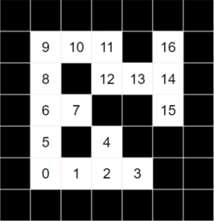
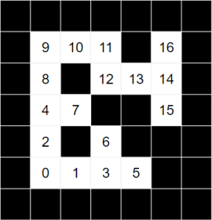

# はじめに

夏休みにアプリNaviでAdvent Calendar的なものをすることになり、Unityで迷路の自動生成と自動探索を実装してみましたので、今回はそれを記事に書いていこうと思います。(といっても他の記事からロジックを拝借して実装しただけですが...)

# 迷路の自動生成

まず迷路の自動生成を行います。迷路の自動生成は以下の記事から棒倒し法のロジックを拝借いたしました。棒倒し法で生成した迷路をUnityで実体化しております。<br>
棒倒し法について知りたい方は以下の記事を参考にしてください。

[アルゴリズム初心者向けの基礎と入門(C#, Pythonとか)](https://algoful.com/Archive/Algorithm/MazeExtend)

# 迷路の自動探索

続いて迷路の探索について書いていきます。<br>
迷路の探索ロジックは以下の２つが有名です。

* 深さ優先探索(Depth First)
* 幅優先探索(Breadth First)

<br>

## 深さ優先探索

　深さ優先探索ではStackというデータ構造を使います。Stackはデータの出し入れが後入れ先出し方式(Last In First Out)となっております。<br>
　例えば皿洗いをしている際、洗い終わった皿を上に積んでいくとします。皿を洗い終わったあと棚にしまう際、お皿の上からしまうと思います。最後に洗い終わった皿からしまうので「後入れ先出し」というわけです。<br>
　なお、Stackにデータを入れることをPush、データを取り出すことをPopといいます。


深さ優先探索のアルゴリズムは以下のとおりです
1. 現在地をすでに通ったマスに設定後、現在地から移動可能なマス(壁ではない＆すでに通ったマスではない)を取得する。(マスが見つかり次第、移動可能なマスの探索は終了する)
2. 進めるマスがあれば現在地をStackにPushし、現在地を1で取得したマスに変更する。
3. 進めるマスがなければスタックからPopし、そのマスを現在地とする。(前のマスに戻る処理)
4. ゴールするまで1 ~ 3を繰り返す

なお、深さ優先探索の実装ではStackの中身が0個になった時点でゴールまでのルートなしとして処理を止めています。

迷路の経路に探索される順番を割り当てると以下の図のようになります。(方向の優先度は適当)



図より行き止まりまでまっすぐに探索していることがわかると思います。<br>

深さ優先探索では次のような特徴があります。
* 迷路と探索の優先度によって早く経路を求めることができる
* メモリの消費量が少ない。
* 迷路と探索の優先度によって計算時間が大きくなる。
* 求めた経路が最短経路であるとは限らない

<br>

## 幅優先探索
　
　幅優先探索ではQueue(キュー)というデータ構造を使います。Queueはデータの出し入れが先入れ先出し方式(First In First Out)となっております。<br>
　コンビニやスーパーのレジをイメージするとわかりやすいと思います。レジでは先に並んだお客さんから精算されますが、Queueもデータを取り出す際、先に入れられたデータから取り出されます。
　なお、Queueにデータを入れることをEnqueue(エンキュー)、データを取り出すことをDequeue(デキュー)と言います。


幅優先探索のアルゴリズムは以下のとおりです。

1. 現在地をすでに通ったマスに設定後、現在地から移動可能なマスをすべて取得する。
2. 取得した移動可能なマスをすべてQueueに格納する。このとき、移動可能なマスがどこマスから来たのか記録しておく。(のちに最短経路を求める際に利用)
3. Queueからマスを一つ取り出し、現在地とする。
4. ゴールするまで1~3を繰り返す。

なお、深さ優先探索と同様Queueの中身が0個になった時点でゴールまでのルートなしとして処理を止めています。

迷路の経路に幅優先探索で探索される順番を割り当てると以下の図のようになります。(方向の優先度は適当)



図よりスタート地点から広がっていくように探索されていることがわかると思います。

幅優先探索では次のような特徴があります。
* 安定した時間で経路を求めることができる。
* 常に最短経路を求めることができる。
* 迷路によっては計算時間が大きくなる(複雑な地形や大きな迷路など)。
* メモリの消費量が大きい

# 実装

まず、棒倒し法をつかって迷路の自動生成をしていきます。int型の２次元配列で返すようにしています。0を通路、1を壁としています。

<details>
<summary>コード</summary>


```C#
using System;
using System.Text;
using UnityEngine;

public class Maze
{
    const int PATH = 0;
    const int WALL = 1;

    public static int[,] Generate(int width, int height) {
        // 5未満のサイズでは生成できない
        if (height < 5 || width < 5) throw new ArgumentOutOfRangeException();
        if (width % 2 == 0) width++;
        if (height % 2 == 0) height++;

        // 指定サイズで生成し外周を壁にする
        var maze = new int[width, height];
        for (int x = 0; x < width; x++)
            for (int y = 0; y < height; y++)
                if (x == 0 || y == 0 || x == width - 1 || y == height - 1)
                    maze[x, y] = WALL; // 外周はすべて壁
                else
                    maze[x, y] = PATH;  // 外周以外は通路

        // 棒を立て、倒す
        var rnd = new System.Random();
        for (int x = 2; x < width - 1; x += 2) {
            for (int y = 2; y < height - 1; y += 2) {
                maze[x, y] = WALL; // 棒を立てる

                // 倒せるまで繰り返す
                while (true) {
                    // 1行目のみ上に倒せる
                    int direction;
                    if (y == 2)
                        direction = rnd.Next(4);
                    else
                        direction = rnd.Next(3);

                    // 棒を倒す方向を決める
                    int WALLX = x;
                    int WALLY = y;
                    switch (direction) {
                        case 0: // 右
                            WALLX++;
                            break;
                        case 1: // 下
                            WALLY++;
                            break;
                        case 2: // 左
                            WALLX--;
                            break;
                        case 3: // 上
                            WALLY--;
                            break;
                    }
                    // 壁じゃない場合のみ倒して終了
                    if (maze[WALLX, WALLY] != WALL) {
                        maze[WALLX, WALLY] = WALL;
                        break;
                    }
                }
            }
        }
        return maze;
    }

    public static void DebugPrint(int[,] maze) {
        StringBuilder sb = new StringBuilder();
        for (int y = maze.GetLength(0) - 1; 0 <= y; y--) {
            for (int x = 0; x < maze.GetLength(1); x++) {
                sb.Append($"{maze[x, y]}, ");
            }
            sb.Append("\n");
        }
        Debug.Log(sb);
    }
}
```

</details>
<br>

つづいて探索の実装です。深さ優先探索、幅優先探索をそれぞれ実装しています。

<details>
<summary>コード</summary>

```C#
using System.Collections;
using System.Collections.Generic;
using System;
using UnityEngine;

public class Searcher
{
    const int PATH = 0;
    const int WALL = 1;
    const int GOAL = 2;
    const int ALREADYPASS = 1;

    private int[,] maze;

    //通過した経路を記録する配列。
    //0:通過していない通路, 1:通過した通路または壁
    int[,] passedCells;

    public Searcher(int[,] maze) {
        this.maze = maze;
        passedCells = new int[maze.GetLength(0), maze.GetLength(1)];
    }

    //深さ優先探索
    public Tuple<int, int>[] DepthFirst(Tuple<int, int> startPos, Tuple<int, int> goal) {

        if (maze[startPos.Item1, startPos.Item2] != PATH) {
            throw new Exception("開始地点が通路ではありません");
        }
        if (maze[goal.Item1, goal.Item2] != PATH) {
            throw new Exception("ゴールが通路ではありません");
        }

        var stack = new Stack<Tuple<int, int>>();
        var currentPos = startPos;
        maze[goal.Item1, goal.Item2] = GOAL;
        Array.Copy(maze, passedCells, maze.Length);

        while (true) {
            passedCells[currentPos.Item1, currentPos.Item2] = 1;
            var nextPos = GetCandidate(currentPos);
            Maze.DebugPrint(passedCells);

            if (nextPos == null) {

                if (stack.Count == 0) break;

                currentPos = stack.Pop();
                continue;
            }

            stack.Push(currentPos);

            currentPos = nextPos;

            if (maze[currentPos.Item1, currentPos.Item2] == GOAL) {
                stack.Push(currentPos);
                break;
            }
        }

        var route = stack.ToArray();
        Array.Reverse(route);

        return route;
    }

    //幅優先探索
    public Tuple<int, int>[] BreadthFirst(Tuple<int, int> startPos, Tuple<int, int> goal) {

        if (maze[startPos.Item1, startPos.Item2] != PATH) {
            throw new Exception("開始地点が通路ではありません");
        }
        if (maze[goal.Item1, goal.Item2] != PATH) {
            throw new Exception("ゴールが通路ではありません");
        }

        var isGoal = false;
        var queue = new Queue<Tuple<int, int>>();
        //進めるマスがどこから来たか記録する辞書型
        var dict = new Dictionary<Tuple<int, int>, Tuple<int, int>>();
        var currentPos = startPos;
        maze[goal.Item1, goal.Item2] = GOAL;
        Array.Copy(maze, passedCells, maze.Length);

        while (true) {
            passedCells[currentPos.Item1, currentPos.Item2] = 1;
            var candidates = GetCandidates(currentPos);
            foreach (var candidate in candidates) {
                queue.Enqueue(candidate);
                dict[candidate] = currentPos;
            }

            if (queue.Count == 0) break;

            currentPos = queue.Dequeue();

            if (maze[currentPos.Item1, currentPos.Item2] == GOAL) {
                isGoal = true;
                break;
            }
        }

        var route = new List<Tuple<int, int>>();
        while (isGoal) {
            route.Insert(0, currentPos);
            if (currentPos == startPos) break;
            currentPos = dict[currentPos];
        }

        return route.ToArray();
    }

    //現在地から移動可能なマスを取得する
    private Tuple<int, int> GetCandidate(Tuple<int, int> cell) {
        if (IsNotWALL(cell.Item1 + 1, cell.Item2) && !IsAlreadyPassed(cell.Item1 + 1, cell.Item2)) return new Tuple<int, int>(cell.Item1 + 1, cell.Item2);
        if (IsNotWALL(cell.Item1, cell.Item2 + 1) && !IsAlreadyPassed(cell.Item1, cell.Item2 + 1)) return new Tuple<int, int>(cell.Item1, cell.Item2 + 1);
        if (IsNotWALL(cell.Item1 - 1, cell.Item2) && !IsAlreadyPassed(cell.Item1 - 1, cell.Item2)) return new Tuple<int, int>(cell.Item1 - 1, cell.Item2);
        if (IsNotWALL(cell.Item1, cell.Item2 - 1) && !IsAlreadyPassed(cell.Item1, cell.Item2 - 1)) return new Tuple<int, int>(cell.Item1, cell.Item2 - 1);
        return null;
    }

    private List<Tuple<int, int>> GetCandidates(Tuple<int, int> cell) {
        var result = new List<Tuple<int, int>>();
        if (IsNotWALL(cell.Item1 + 1, cell.Item2) && !IsAlreadyPassed(cell.Item1 + 1, cell.Item2)) result.Add(new Tuple<int, int>(cell.Item1 + 1, cell.Item2));
        if (IsNotWALL(cell.Item1, cell.Item2 + 1) && !IsAlreadyPassed(cell.Item1, cell.Item2 + 1)) result.Add(new Tuple<int, int>(cell.Item1, cell.Item2 + 1));
        if (IsNotWALL(cell.Item1 - 1, cell.Item2) && !IsAlreadyPassed(cell.Item1 - 1, cell.Item2)) result.Add(new Tuple<int, int>(cell.Item1 - 1, cell.Item2));
        if (IsNotWALL(cell.Item1, cell.Item2 - 1) && !IsAlreadyPassed(cell.Item1, cell.Item2 - 1)) result.Add(new Tuple<int, int>(cell.Item1, cell.Item2 - 1));
        return result;
    }

    private bool IsNotWALL(int x, int y) {
        return (0 <= x && x < maze.GetLength(0)) && (0 <= y && y < maze.GetLength(1)) && maze[x, y] != WALL;
    }

    private bool IsAlreadyPassed(int x, int y) {
        return passedCells[x, y] == ALREADYPASS;
    }
}
```
</details>
<br>

最後に呼び出し側の実装です。まず、Mazeクラスから迷路の作成結果を受け取り、オブジェクトを配置しています。配置が完了すると自動探索でゴールまでの経路を導き、受け取った経路をもとにPlayerオブジェクトを動かしています。
<details>
<summary>コード</summary>

```C#
using System.Collections;
using System.Collections.Generic;
using System;
using UnityEngine;

enum Mode {
    DepthFirst,
    BreadthFirst
}

public class Generator : MonoBehaviour
{
    [SerializeField] private Mode mode = Mode.DepthFirst;

    int[,] maze;
    [SerializeField] private int width = 7;
    [SerializeField] private int height = 7;

    [SerializeField] private GameObject wall;
    [SerializeField] private GameObject playerPrefab;

    const int PATH = 0;
    const int WALL = 1;

    IEnumerator Start()
    {
        var maze = Maze.Generate(width, height);
        Debug.Log("Maze is generated");
        Maze.DebugPrint(maze);
        yield return StartCoroutine(GenerateStage(maze));
        var searcher = new Searcher(maze);
        var startPos = new Tuple<int, int>(1, 1);
        var goalPos = new Tuple<int, int>(5, 5);
        var route = mode == Mode.DepthFirst ?
            searcher.DepthFirst(startPos, goalPos) :
            searcher.BreadthFirst(startPos, goalPos);
        Debug.Log($"route length : {route.Length}");
        foreach(var cell in route) {
            Debug.Log($"x:{cell.Item1}, y:{cell.Item2}");
        }
        yield return StartCoroutine(Go(route));
    }

    private IEnumerator GenerateStage(int[,] maze) {
        int wallSizeX = 1;
        int wallSizeZ= 1;
        for (int i = 0; i < maze.GetLength(0); i++) {
            for (int j = 0; j < maze.GetLength(1); j++) {
                if (maze[i, j] == WALL) {
                    Instantiate(wall, new Vector3(wallSizeX * i, 0.25f, wallSizeZ * j), Quaternion.identity);
                    yield return new WaitForSeconds(0.1f);
                }
            }
        }
    }

    private IEnumerator Go(Tuple<int, int>[] route) {
        var player = Instantiate(playerPrefab, new Vector3(route[0].Item1, 1, route[0].Item2), Quaternion.identity);

        for (int i = 1; i < route.Length; i++) {
            player.transform.position = new Vector3(route[i].Item1, 1, route[i].Item2);
            Debug.Log($"i:{i}, position({route[i].Item1}, 1, {route[i].Item2})");
            yield return new WaitForSeconds(0.5f);
        }
    }
}
```

</details>
<br>

以下の画像はMazeクラスで作成した迷路をもとにUnity上にオブジェクトを配置した結果です。


## 最後に
今回は迷路を自動生成し、探索アルゴリズムを用いてゴールまでの経路を求めてみました。配列からUnityへの座標変換で少し手こずりましたがなんとか実装できたと思います。もし間違いやもっとこうしたほうが良いというアドバイスがありましたら、アプリNavi宛にご連絡頂けますと幸いです。
<br>
<br>
また今回のプロジェクトはGithubにあげておりますので、もしよろしければ御覧ください。
ここまで読んでいただきありがとうございました。

[Github](https://github.com/syota-kawaguchi/MazeSearch)
