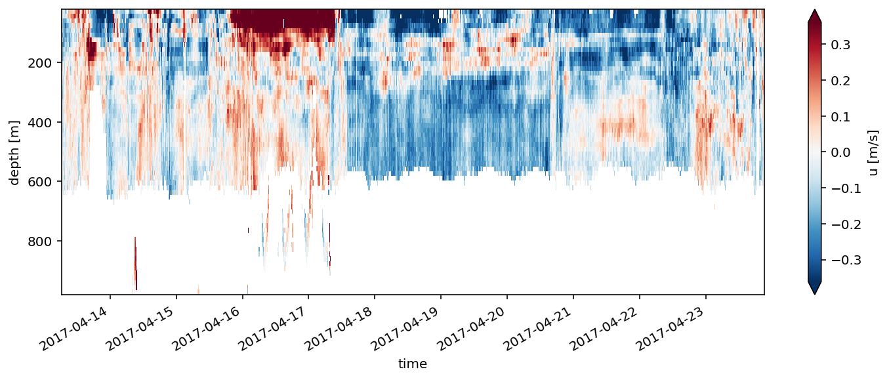
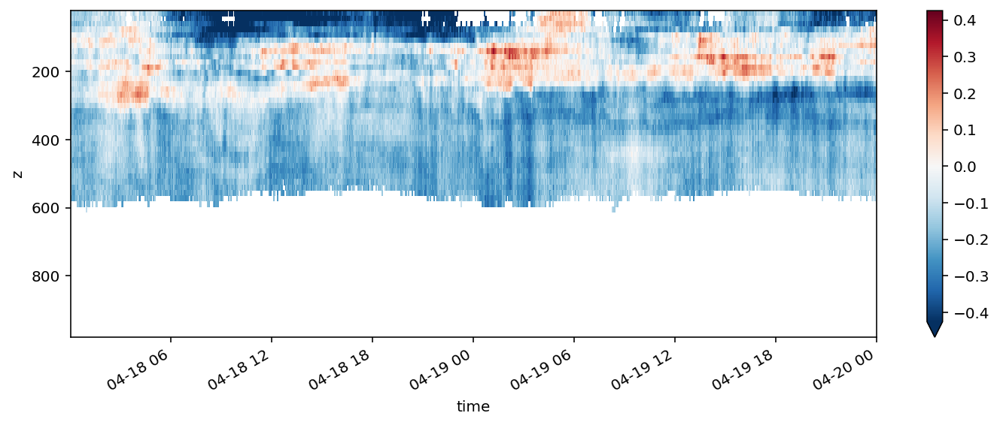
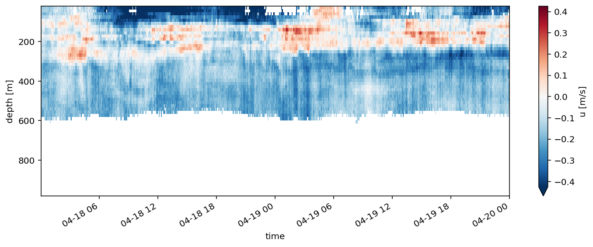

## FLEAT 2017 Quick look at UH SADCP Data


```python
# %load /Users/gunnar/Projects/python/standard_imports.py
%matplotlib inline
import matplotlib.pyplot as plt
import matplotlib as mpl
import numpy as np
from datetime import datetime, timedelta
import xarray as xr
import os
import glob
from munch import munchify
from pathlib import Path

import pytowyo
import gvpy as gv

%reload_ext autoreload
%autoreload 2
%config InlineBackend.figure_format = 'retina'
```

## Read netcdf


```python
uhpath = Path('/Users/gunnar/Projects/fleat/data/gridded/RR1708/sadcp/')
uhncfiles = list(uhpath.glob('*.nc'))
print(uhncfiles[1])
```

    /Users/gunnar/Projects/fleat/data/gridded/RR1708/sadcp/os75nb.nc


```python
tmp = xr.open_dataset(uhncfiles[1])
```

Change from depth_cell to depth. Depth does not really change over time.


```python
mdepth = tmp.depth.median(dim='time')
tmp = tmp.drop('depth')
# tmp['depth'] = (['depth_cell'], mdepth)
tmp = tmp.rename_dims({'depth_cell': 'z'})
tmp.coords['z'] = (['z'], mdepth)
```

Fix some attributes


```python
tmp.z.attrs = dict(long_name='depth', units='m')
tmp.u.attrs = dict(long_name='u', units='m/s')
tmp.v.attrs = dict(long_name='v', units='m')
tmp.time.attrs = dict(long_name='time', units='')
```


```python
tmp
```


    <xarray.Dataset>
    Dimensions:     (time: 5095, z: 60)
    Coordinates:
      * time        (time) datetime64[ns] 2017-04-13T06:25:41.999999999 ... 2017-04-23T21:07:40
      * z           (z) float32 28.98 44.98 60.98 76.98 ... 940.98 956.98 972.98
    Data variables:
        trajectory  int32 ...
        lon         (time) float64 ...
        lat         (time) float64 ...
        u           (time, z) float32 ...
        v           (time, z) float32 ...
        amp         (time, z) float32 ...
        pg          (time, z) float32 ...
        pflag       (time, z) int8 ...
        heading     (time) float32 ...
        tr_temp     (time) float32 ...
        num_pings   (time) int8 ...
        uship       (time) float32 ...
        vship       (time) float32 ...
    Attributes:
        featureType:            trajectoryProfile
        history:                Created: 2017-04-23 21:08:25 UTC
        Conventions:            COARDS
        software:               pycurrents
        hg_changeset:           2344:6a53e4c1c4e4
        title:                  Shipboard ADCP velocity profiles
        description:            Shipboard ADCP velocity profiles from RR1708 usin...
        cruise_id:              RR1708
        sonar:                  os75nb
        yearbase:               2017
        CODAS_variables:        \nVariables in this CODAS short-form Netcdf file ...
        CODAS_processing_note:  \nCODAS processing note:\n======================\...


Transpose (reorder dimensions).


```python
tmp = tmp.transpose('z', 'time')
```


```python
tmp
```


    <xarray.Dataset>
    Dimensions:     (time: 5095, z: 60)
    Coordinates:
      * time        (time) datetime64[ns] 2017-04-13T06:25:41.999999999 ... 2017-04-23T21:07:40
      * z           (z) float32 28.98 44.98 60.98 76.98 ... 940.98 956.98 972.98
    Data variables:
        trajectory  int32 ...
        lon         (time) float64 ...
        lat         (time) float64 ...
        u           (z, time) float32 ...
        v           (z, time) float32 ...
        amp         (z, time) float32 ...
        pg          (z, time) float32 ...
        pflag       (z, time) int8 ...
        heading     (time) float32 ...
        tr_temp     (time) float32 ...
        num_pings   (time) int8 ...
        uship       (time) float32 ...
        vship       (time) float32 ...
    Attributes:
        featureType:            trajectoryProfile
        history:                Created: 2017-04-23 21:08:25 UTC
        Conventions:            COARDS
        software:               pycurrents
        hg_changeset:           2344:6a53e4c1c4e4
        title:                  Shipboard ADCP velocity profiles
        description:            Shipboard ADCP velocity profiles from RR1708 usin...
        cruise_id:              RR1708
        sonar:                  os75nb
        yearbase:               2017
        CODAS_variables:        \nVariables in this CODAS short-form Netcdf file ...
        CODAS_processing_note:  \nCODAS processing note:\n======================\...


Make this a function for fast access in the future.


```python
def read_sadcp(ncfile):
    sadcp = xr.open_dataset(ncfile)
    
    mdepth = sadcp.depth.median(dim='time')
    sadcp = sadcp.drop('depth')
    # sadcp['depth'] = (['depth_cell'], mdepth)
    sadcp = sadcp.rename_dims({'depth_cell': 'z'})
    sadcp.coords['z'] = (['z'], mdepth)
    # Fix some attributes
    sadcp.z.attrs = dict(long_name='depth', units='m')
    sadcp.u.attrs = dict(long_name='u', units='m/s')
    sadcp.v.attrs = dict(long_name='v', units='m')
    sadcp.time.attrs = dict(long_name='time', units='')
    # Transpose (re-order dimensions)
    sadcp = sadcp.transpose('z', 'time')    
    
    return sadcp
```


```python
test = read_sadcp(uhncfiles[0])
```

ok, now also included in gvpy


```python
tmp = gv.io.read_sadcp(uhncfiles[1])
```


```python
tmp.u.plot(x='time', figsize=(12,4), yincrease=False, robust=True)
```


    <matplotlib.collections.QuadMesh at 0x12044bf28>





```python
tmp.u.where(tmp.pflag==0).plot(x='time', figsize=(12,4), yincrease=False, robust=True)
```


    <matplotlib.collections.QuadMesh at 0x120472240>


## Read .mat

I'm not quite sure of the best way to work with the UH data. The .mat files generated load_getmat have a nanmask - is the result similar to what we get from the netcdf file?


```python
uhmatfiles = sorted(list(uhpath.glob('*.mat')))
print(uhmatfiles[1])
```

    /Users/gunnar/Projects/fleat/data/gridded/RR1708/sadcp/rr1708_sadcp_75khz.mat


```python
def uhmat_to_uhDataset(uhfile):
    tmp = gv.gvimport.gvloadmat(uhfile, onevar=True)
    tmp.time = gv.gvimport.mtlb2datetime(tmp.dtnum)
    
    uh = xr.Dataset(data_vars={'u': (['z', 'time'], tmp.u),
                               'v': (['z', 'time'], tmp.v),
                               'w': (['z', 'time'], tmp.w),
                               'nanmask': (['z', 'time'], tmp.nanmask)
                               },
                coords={'time': (['time'], tmp.time),
                        'lon': (['time'], tmp.lon),
                        'lat': (['time'], tmp.lat),
                        'z': (['z'], tmp.z)
                        })
    return uh
```


```python
uh = {}
uh['75k'] = uhmat_to_uhDataset(uhmatfiles[1])
uh['150k'] = uhmat_to_uhDataset(uhmatfiles[0])
```

    returning munchified data structure
    returning munchified data structure


## Compare


```python
tmp2 = uh['75k']
```


```python
time_interval = slice('2017-04-18', '2017-04-19')
```

Plot .mat-file with nanmask applied.


```python
(tmp2.u * tmp2.nanmask).sel(time=time_interval).plot(x='time', figsize=(12,4), yincrease=False, robust=True)
```


    <matplotlib.collections.QuadMesh at 0x1228232b0>





Plot netcdf file with pflag applied.

From UHDAS website https://currents.soest.hawaii.edu/docs/adcp_doc/ADCP_INTERPRETATION/adcp_access/READING/NetCDF/index.html?highlight=pflag
```
Profile flags
-------------
Profile editing flags are provided for each depth cell:

binary    decimal    below    Percent
value     value      bottom   Good       bin
-------+----------+--------+----------+-------+
000         0
001         1                            bad
010         2                  bad
011         3                  bad       bad
100         4         bad
101         5         bad                bad
110         6         bad      bad
111         7         bad      bad       bad
-------+----------+--------+----------+-------+
```


```python
tmp.u.where(tmp.pflag==0).sel(time=time_interval).plot(x='time', figsize=(12,4), yincrease=False, robust=True)
```


    <matplotlib.collections.QuadMesh at 0x1256c6f98>





Plot netcdf file.


```python
tmp.u.sel(time=time_interval).plot(x='time', figsize=(12,4), yincrease=False, robust=True)
```


    <matplotlib.collections.QuadMesh at 0x12562d160>


