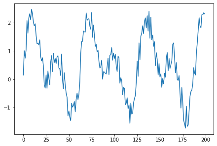

[Jupyter notebooks](https://jupyter.org/) are a great tool for explorative data analysis. However, they tend to get a little messy as a project grows in size and I have gotten into the habit of moving most of my code into external packages which I then import into a notebook. This way, I can still keep figures and notes in the notebook while keeping the analysis code modular and being able to edit it in an external editor. Using IPython's `%autoreload` magic, the external code can automatically be udpated inside the notebook every time a cell is re-evaluated. Awesome! The only slightly annoying part of this workflow is having to jump back and forth between editor and notebook every time the code has been changed, just to re-evaluate a cell.

Meet [watchmagic](https://github.com/gunnarvoet/watchmagic). It adds the `%%watch` magic command to IPython. If added to the top of a cell, `%%watch` will observe a given directory and re-evaluate the cell on file changes. This way, I only have to save my progress in the editor and can watch the notebook update by itself whenever I change a file. Under the hood, [watchmagic](https://github.com/gunnarvoet/watchmagic) leverages the [watchdog](https://pythonhosted.org/watchdog/) package.

Installation of [watchmagic](https://github.com/gunnarvoet/watchmagic) is as simple as
```shell
pip install watchmagic
```

A very basic example of displaying a plot in the notebook with analysis code development in the external file `science_plots.py` may look like this:
```python
# import external package with analysis code
import science_plots
# load autoreload magic
%load_ext autoreload
# set autoreload to act on all imports
%autoreload 2
# load watch magic
%load_ext watchmagic
```
```python
%%watch --patterns *.py
# call external code
science_plots.overview_plot()
```

After editing `science_plots.py` and saving it, the plot will be updated:
```shell
watch: ./science_plots.py has been modified
```



By default, `%%watch` will look for changes in the current directory. A different directory can be supplied via the `--path` command line option. In the example above the `--patterns` command line option is used to only look for changes in `*.py` files. The following command line options are available:
```shell
-p PATH, --path PATH  provides the PATH to watch for file changes. If
                        not provided, the current directory will be
                        watched.
-r, --recursive       include subdirectories recursively when
                        watching for file changes. This is the default
                        behaviour.
-nr, --non-recursive  do not include subdirectories when watching for
                        file changes.
--patterns <[PATTERNS [PATTERNS ...]]>
                        look for files with these PATTERNS.
--ignore <[IGNORE_PATTERNS [IGNORE_PATTERNS ...]]>
                        ignore files containing IGNORE_PATTERNS when
                        watching for file changes.
```

Defaults for a few parameters can be set in the [.ipython_config.py](https://ipython.readthedocs.io/en/stable/config/intro.html#setting-configurable-options) file by adding any of the following lines:
```python
#---------------------------------------------------------------
# WatchMagics configuration
#---------------------------------------------------------------
c.WatchMagics.default_patterns = ['*.py']
c.WatchMagics.default_ignore_patterns = ['*.ipynb']
c.WatchMagics.default_case_sensitive = False
c.WatchMagics.default_ignore_directories = True
```

<!--  -->
