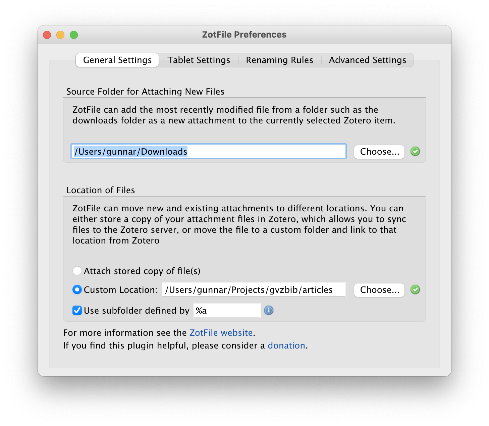
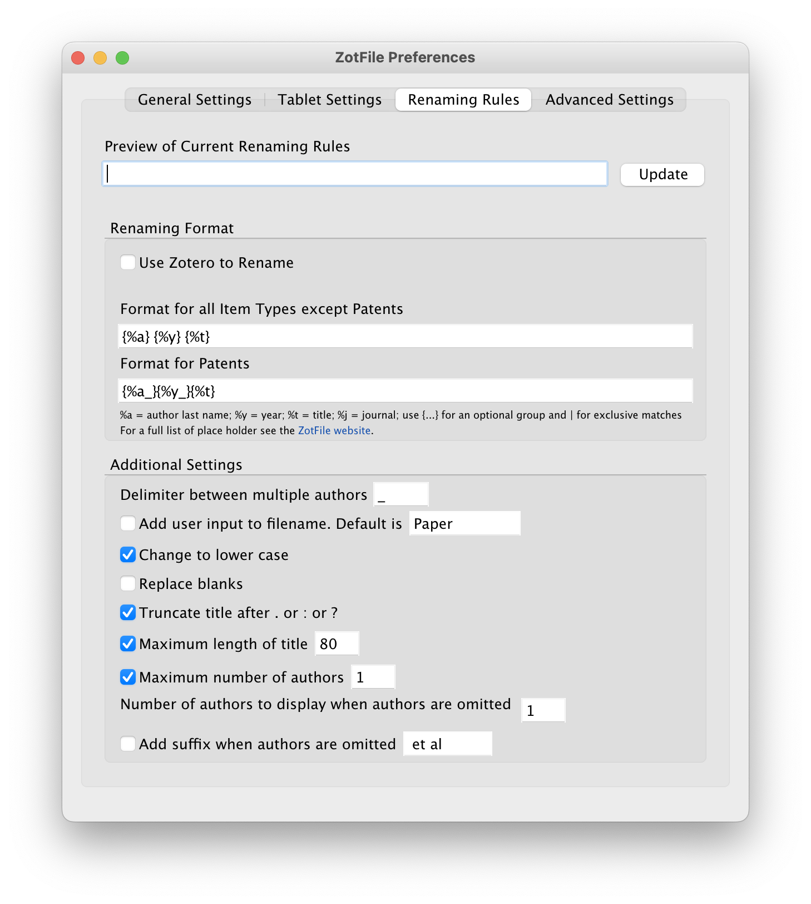
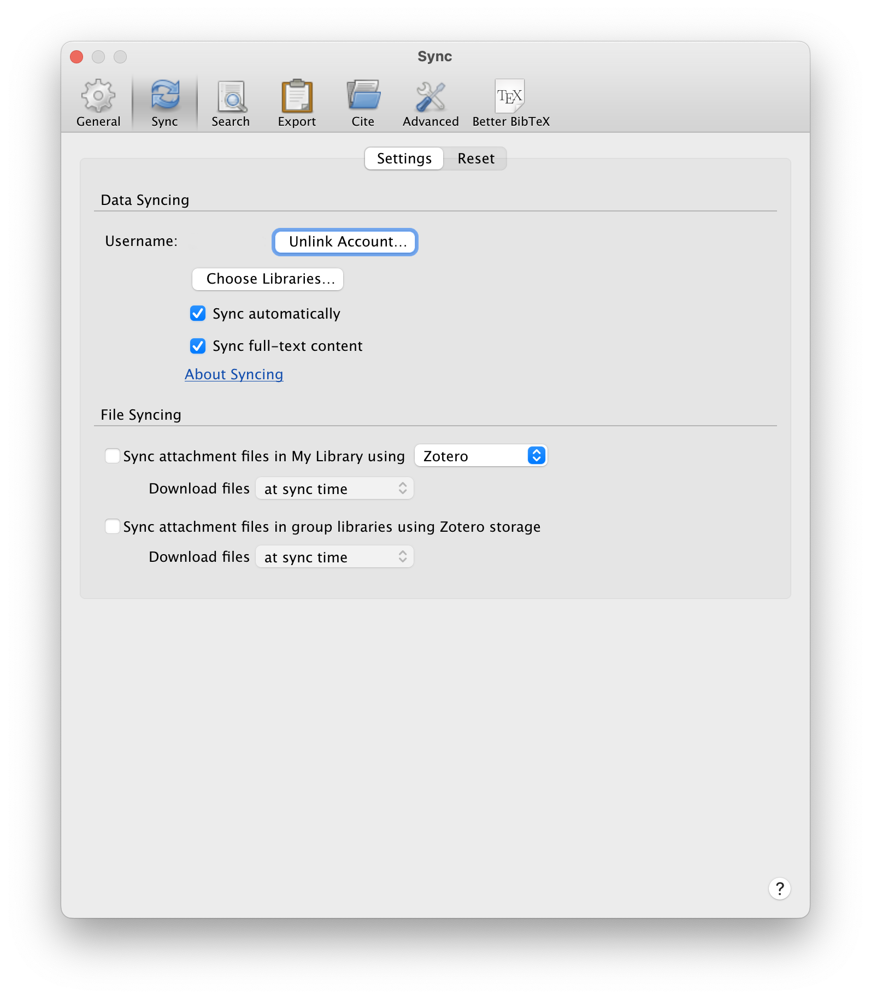
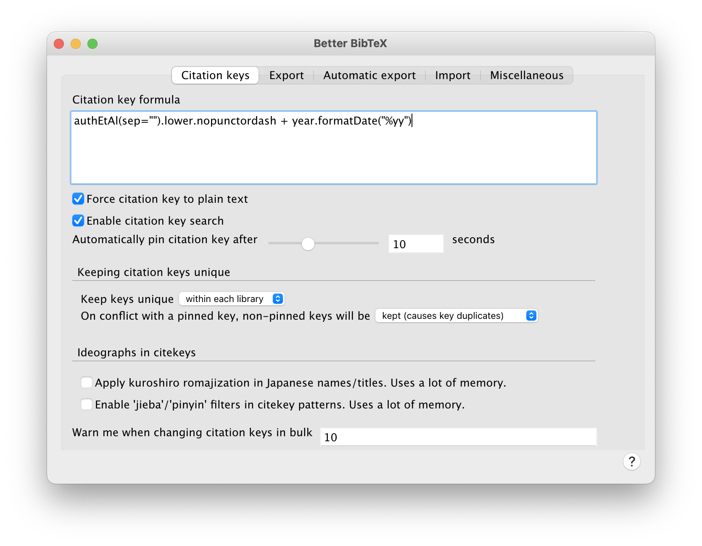

<!-- Advantages of using a virtual environment: -->

<!-- Isolation: A virtual environment provides an isolated space where you can install packages and dependencies without affecting your system Python or other projects. This means you can experiment with different packages and versions without worrying about conflicts or unintended consequences. -->

<!-- Reproducibility: By using a virtual environment, you can easily recreate the exact same environment on another machine or for a different project. This is especially useful when collaborating with others or when sharing your code. -->

<!-- Package management: With virtual environments, you can easily manage packages and dependencies for each project separately. This means you can install different versions of the same package for different projects, without worrying about conflicts or compatibility issues. -->

<!-- Consistency: By using a virtual environment, you can ensure that your project dependencies are consistent and up to date. This makes it easier to maintain your code and avoid unexpected errors or bugs. -->

<!-- Easy setup: Setting up a virtual environment is a straightforward process and can be done quickly with a few simple commands. This means you can get started on your project right away without spending time setting up your environment. -->

Anyone working in scientific research reads and eventually writes [papers](/publication/). Quickly, one accumulates a bunch of journal articles in pdf format and the need for some kind of literature database arises.
After many years of using [BibDesk](https://bibdesk.sourceforge.io/manual/) I recently switched to [Zotero](https://www.zotero.org/) and have been quite happy so far with my new workflow.
BibDesk is still an excellent tool and I only stumbled upon Zotero when I was looking for a bibliography management system that easily syncs between macos and Linux operating systems.

In the following, I describe how I set up Zotero to quite efficiently fulfill my needs for filing, referencing, and reading journal articles and books.
The setup also syncs my literature database between individual computers (and operating systems!).
This writeup is probably not overly interesting unless you write papers in [LaTeX](https://www.latex-project.org/) with the help of the [BibTeX](https://www.bibtex.org/) bibliography tool. There are other guides out there that talk about, for example, how to integrate Zotero with your favorite Word processor.

Zotero is open source software and can be installed via [direct download](https://www.zotero.org/download/) or using the software manager of your choice and/or operating system. Make sure to also install the browser connector in your web browser, also available from the download page. It provides a button in your web browser that allows for quickly (one click is all that's usually needed!) adding a journal article, including the pdf file, to your Zotero database.

The [ZotFile](http://zotfile.com/) and [Better BibTex](https://retorque.re/zotero-better-bibtex/) plugins are key to my workflow.
ZotFile helps with automatically renaming and filing pdf files.
It also allows for keeping the pdf file collection outside the Zotero database, thereby allowing for syncing using the file syncing software of your choice and avoiding paying for the Zotero sync service that charges for databases larger than 300MB.
If you don't mind paying a bit for their service you can of course simply use Zotero's online storage and thereby support the nonprofit [Corporation for Digital Scholarship](https://digitalscholar.org/) that develops and runs Zotero.
I prefer to have my pdfs outside the Zotero database just in case I ever want to change to a different system.
I use the open source tool [Syncthing](https://syncthing.net/) to sync my paper collection with my office server but services like Dropbox or Google Drive should work equally well.
Here is how I set ZotFile to save new pdf files to a specific directory (and subsequently have them sorted into one folder per author name).

The pdf files can be renamed to your liking using various patterns. Here is how I rename to first author / year / title which I find a nice format for when I share the pdf file with colleagues:

If you use ZotFile to store pdfs outside the Zotero database make sure to disable Zotero file syncing:


The Better BibTex plugin allows for automatic generation of BibTex citation keys and automatic export of the whole database (or subsets thereof) to .bib files.
Here are my settings for generating citation keys that follow the pattern *author1yy*, *author1author2yy*, and *author1etalyy* depending on the number of authors on the paper.

To export the database to bibtex format, right click it in the left side bar (either your whole Library or only a Collection), choose *Export Library*, and in the following dialogue select Better BibTex and check the *Keep updated* and *Background export* options.
Now, whenever new entries are added to your Zotero database, they will also be added to the corresponding .bib database.
The *Automatic export* tab of the Better BibTex settings lets you adjust automatic exports set up this way.

If you are migrating to Zotero from BibDesk, the [bibdesk2zotero](https://github.com/edsu/bibdesk2zotero) tool may be very helpful in preserving your already existing pdf database along with your existing bibtex database.
Run the following command in your terminal and the newly generated .bib file should be ready for importing to Zotero with working pdf file links:
```shell
bibdesk2zotero citations.bib /path/to/pdf/files/ > new-citations.bib
```

One feature of Zotero that I really like is the ability of adding new entries (including downloading the corresponding pdf of a paper) by providing just a doi. Simply copy the doi into the magic wand field (button on the top toolbar) and - et voilà! - the publication has been added to your database and you can start reading the paper right away.
