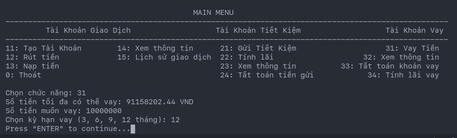

# Bài kiểm tra kết thúc module Java Core
Đề bài: Thiết kế ứng dụng ngân hàng mô phỏng các chức năng tạo tài khoản, nạp/rút tiền, tài khoản gửi/vay, tất toán khoản gửi/vay, ...

Diagram mô tả cấu trúc ứng dụng:


# Plugins - Tools sử dụng
- Maven : build và quản lý Dependency
- [Plantuml](https://plantuml.com/) : plugin tạo diagram

# Mô tả chức năng, hoạt động ứng dụng:
- Lấy code về
```
git clone https://github.com/truongvantuan/Banking_Techmaster_Java1B.git 
```
- compile lại code
```
mvn clean
mvn compiler:compile
```

1. Menu  - chọn chức năng với số tương ứng


- Tạo tài khoản: tạo mới tài khoản với tên và số CMND, tài khoản đã có báo "Tài khoản đã được tạo!". Các tài khoản sẽ được giả định tạo trong quá khứ để test các chức năng tất toán tài khoản.


- Lịch sử giao dịch: xem thông tin thay đổi tài khoản, tiền nạp/rút, các giao dịch làm biến động số dư.


2. Mở tài khoản tiết kiệm
 - Mỗi tài khoản có thể mở nhiều tài khoản tiếp kiệm. Với tùy chọn số tiền gửi, kỳ hạn gửi và số tiền gửi góp vào hàng tháng tiếp theo.
 - Tất toán tiền gửi: sẽ xóa bỏ tài khoản tiền gửi, cộng lãi và gốc vào tài khoản hiện tại. Giao dịch được ghi lại và liệt kê tại Lịch sử giao dịch.


3. Thực hiện vay tiền
- Giả định thẩm định tài sản: bởi số dư hiện có, dẫn đến số tiền có thể vay tối da là nhân 2 lần số dư.
- Thực hiện vay tiền: nhập số tiền cần vay, kỳ hạn vay.
- Tất toán: Tất toán sẽ thực hiện đóng tài khoản vay, sử dụng số dư trong trong tài khoản để tất toán khoản vay.
