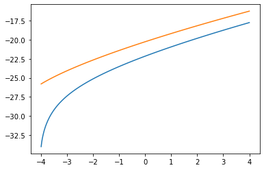
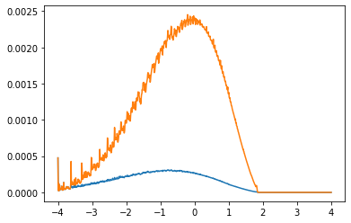
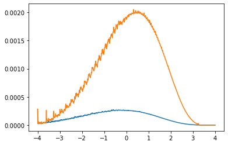

The Huggett (1993) model is an ideal starting point for developing heterogeneous agent solution algorithms. This notebook presents standard solution algorithms with a few extensions.

First, I import relevant python libraries that will be useful in my calculations. 
- `time:` enables time keeping
- `matplotlib:` graph plotting library
- `numpy:` numerical library for working with arrays and vectorized functions
- `interpolation:` provides "jit" linear interpolation
- `numba`: provides just-in-time compilation for speedy calculation
- `quantecon:` provides "jit" maximum search
- `scipy:` provides root finding algorithm


```python
from time import time  # time keeping

import matplotlib.pyplot as plt  # plotting library
import numpy as np  # numerical library
from interpolation import interp  # linear interpolation
from numba import njit  # just-in-time compiling nopython
from numba import prange  # parallel range
from quantecon.optimize import brent_max as argmax  # finding maximum
from scipy.optimize import toms748 as root  # finding roots

%matplotlib inline
```

## Introduction

The most commonly used function for these models is the constant relative risk aversion (CRRA) specification, where the coefficient of risk aversion is $\sigma$. When $\sigma=1$, the limit of the function is $u(c)=\log(c)$, so in my definition I allow for different cases depending on the parameter. I use a function factory to create a jitted function for the model depending on the value of $\sigma$.


```python
def utility(σ):
    @njit
    def log(c):
        return np.log(c)

    @njit
    def iso(c):
        return (c ** (1 - σ) - 1) / (1 - σ)

    return log if σ == 1.0 else iso
```

The agent then maximizes the present value discounted utility of consumption represented by:

\begin{equation}
		\begin{gathered}
		\mathbb{E}_0 \left( \sum_{t=0}^{\infty} \beta^t u(c_t) \right) \quad \text{ where } \beta \in (0, 1), \text{ and}  \\\\
		u(c) = \lim_{\nu \to \sigma} \frac{c^{1-\nu}-1}{1-\nu} \quad \text{ where } \sigma \ge 1.
		\end{gathered}
\end{equation}

The environment is composed of ex-ante identical households with a labor income endowment $e_i$ and a net bond balance of $a$ (savings if positive, debt if negative). The household can then use their total period budget to choose consumption of a non-storable good and next period debt or savings in the form of discount bonds at the price of $q$. Thus the following recursive value function summarizes the household problem:

\begin{equation}
    \begin{gathered}
    V(e_i, a;q) = \underset{(c,a')\in \Gamma(e_i,a;q)}{\max} u(c) + \beta \sum_{j=1}^{n_e} \pi_{ij} V(e_j,a';q) \\\\
    \text{where} \\\\
    \Gamma(e_i,a;q) = \{(c,a'): c+qa' \le e_i + a; c \ge 0; a' \ge \underline{a} \}
    \end{gathered}
\end{equation}

The first step in solving the model is creating a class object that contains the model parameters. I take advantage of python's object oriented programming to create a class of models named HAOS (heterogeneous agent optimal savings) that takes in the following parameters:

- $\sigma \ge 1$: CRRA parameter of relative risk aversion 
- $u$: jitted function to override the CRRA utility form, useful for different utility specifications
- $\beta$: household discount factor for future utility of consumption 
- $e$: the set of possible labor income endowments
- $\pi$: the transition probability matrix for the Markov chain process of labor income
- $\texttt{abounds}$: the range of bonds over which I solve the value, policy, and distribution functions, where the lower bound serves as the credit limit
- $\texttt{na}$: number of grid points used to solve the value function
- $\texttt{nm}$: number of grid points used to solve the distribution function


```python
# Heterogeneous agent optimal savings
class HAOS(object):
    def __init__(
        self,
        σ=1.5,  # CRRA parameter
        β=0.99322,  # discount factor
        e=[0.1, 1.0],  # labor earnings endowment
        π=[[0.5, 0.5], [0.075, 0.925]],  # earnings transition matrix
        abounds=[-4.0, 4.0],  # credit limits
        na=100,  # number of value function grid points
        nm=1000,  # number of distribution grid points
    ):

        self.σ = σ
        self.u = utility(σ)  # create utility function given CRRA coeff
        self.β = β
        self.e, self.π = np.asarray(e), np.asarray(π)  # convert these to arrays
        alow, ahigh = abounds
        self.alow, self.ahigh = abounds
        self.abounds = np.asarray(abounds)
        ne = self.e.size
        self.ne, self.na, self.nm = ne, na, nm

        # grid for value and policy functions
        self.agrid = np.geomspace(1, ahigh - alow + 1, na) + alow - 1
        # grid for distribution
        self.mgrid = np.linspace(alow, ahigh, nm)

        self.init_value()
        self.init_distribution()

    def init_value(self):
        ne, na = self.ne, self.na
        self.v = np.zeros((ne, na))
        self.g = np.zeros((ne, na))

    def init_distribution(self):
        ne, nm = self.ne, self.nm
        self.m = np.zeros((ne, nm))
        mid = int(nm / 2)
        val = 1.0 / ne
        self.m[:, mid] = np.ones(ne) * val
        self.ind = np.empty((ne, nm), dtype=np.int64)
        self.w = np.empty((ne, nm)) * np.nan

    def set_value(self, v, g):
        self.v, self.g = v, g

    def set_distribution(self, m, ind, w):
        self.m, self.ind, self.w = m, ind, w

    def set_solution(self, qstar, Astar):
        self.qstar, self.Astar = qstar, Astar
```

I use a log-spaced grid to solve the value and policy functions, expecting more concavity in the value function near the lower bound, or the credit limit. To solve for the stationary distribution, I use a finer linear grid. Additional helper methods such as $\texttt{init_*}$ and $\texttt{set_*}$ are used to store and clear previous solutions.

## Value Function Iteration and the $T$ operator

To solve the value function, I use value function iteration (VFI) and the $T$ operator, the properties of which are well established in dynamic programming. To avoid having to pass all the model parameters every time I use the T operator, I use a function factory as described below.

The first component is the $\texttt{objective}$ function, which evaluates the value function at a given proposed next period bond choice, given a price of bonds $q$ and a total period budget $y$. The $T$ operator then uses a golden section search algorithm with inverse parabolic interpolation (Brent, 1973) to evaluate the value function at a range of next period bond choices to find a maximum. 

Thus, the $T$ operator takes an initial value function defined over the labor income and the bond grid points to produce a new value function. This operator is designed to allow skipping of the maximization search as described in (Judd, 1998). If I provide an already solved policy function $g$, the operator skips the max search and just evaluates the value of the current state. This option will be used later to speed up VFI. The $T$ operator is as follows:

\begin{equation}
    (Tv)(e_i, a) = \underset{(c,a')\in \Gamma(e_i,a;q)}{\max} u(c) + \beta \sum_{j=1}^{n_e} \pi_{ij} v(e_j,a';q)
\end{equation}


```python
def solver_factory(model, use_parallel=True, xtol=1e-5, maxiter=500):

    u, β = model.u, model.β
    e, π = model.e, model.π
    alow, ahigh = model.abounds
    ne, na = model.ne, model.na
    agrid = model.agrid

    v, g = model.v, model.g

    @njit
    def objective(ap, q, y, Evj):
        c = y - q * ap  # consumption
        if c <= 0.0:  # assert non-negativity constraint
            return -1e16
        Ev = interp(agrid, Evj, ap)  # interpolate expected value of savings
        return u(c) + β * Ev  # value of consumption/savings decision

    @njit(parallel=use_parallel)
    def solver(v, q, g=g, solve=True):
        """
        If `solve` is `True`, you must provide a plausible `g` policy function
        """

        v_new = np.empty_like(v)
        g_new = np.empty_like(g) if solve else g

        Ev = π @ v  # calculate expected continuation value

        for i in prange(na):
            for j in prange(ne):
                y = agrid[i] + e[j]  # wealth
                if solve:
                    aphigh = np.maximum(
                        alow, np.minimum(ahigh, y / q)
                    )  # assert borrowing constraint
                    if aphigh <= alow:  # constraint binds
                        amax = alow
                        vmax = objective(amax, q, y, Ev[j])
                    else:
                        amax, vmax, _ = argmax(
                            objective,
                            alow,
                            aphigh,
                            args=(q, y, Ev[j]),
                            xtol=xtol,
                            maxiter=maxiter,
                        )
                    v_new[j, i] = vmax
                    g_new[j, i] = amax
                else:
                    v_new[j, i] = objective(g[j, i], q, y, Ev[j])

        return v_new, g_new

    solver(v, 1.0, g, True)

    return solver
```

There is an important extension embedded in the $T$ operator above. Whereas in Huggett (1993) the credit limit is picked such that $\underline{a} > \frac{-e_1}{1-q}$ to ensure that any debt can be repaid feasibly, this $T$ operator allows for arbitrarily large credit limits. While this in theory means that agents can borrow more than the maximum amount they can repay, the value function is highly negative when consumption is less than or equal to 0. This induces endogenous and idyosincratic borrowing constraints, such that agents self enforce their borrowing limits even if credit limits are large.

The $\texttt{solve_model}$ subroutine solves the value function by VFI. To do so, it repeatedly uses the $T$ operator defined above to derive the optimal policy, and avoids the costly optimal policy computation when the optimal policy function has reached some level of numerical convergence. The $T$ operator was also designed to take advantage of parallelized computation, so this is an option for solving that I use to compare the efficiency of parallel computing.

- $\texttt{use_parallel}$: if $\texttt{True}$, computations are performed in parallel
- $\texttt{use_existing}$: if $\texttt{True}$, the value function uses a pre-solved value function, which might be useful if I have solved the value function before
- $\texttt{tol}$: the subroutine stops when $|Tv-v|\le \texttt{tol}$
- $\texttt{maxiter}$: the subroutine stops at a maximum number of loops to avoid infinite looping
- $\texttt{skip_policy}$: if $\texttt{True}$, the subroutine skips policy evaluation when $|g_{t+1}-g_{t}| \le \texttt{tol}*0.1$
- $\texttt{solve_skip}$: when the subroutine skips policy evaluation, it re-evaluates policy after a set number of iterations
- $\texttt{verbose}$: optional print argument to see if VFI error is decreasing (debug)
- $\texttt{print_skip}$: avoid printing every single iteration, instead only print error every $\texttt{print_skip}$ iterations


```python
def solve_value(
    model,  # model parameters
    solver,  # solver operator
    q,  # price of credit balance
    use_existing=False,  # reset value
    tol=1e-4,  # convergence tolerance for value
    maxiter=2000,  # stop after maxiter if it does not converge
    skip_policy=False,
    solve_skip=100,
    verbose=True,
    print_skip=100,
):

    start = time()

    if not use_existing:
        model.init_value()  # set back to 0 matrix

    v, g = model.v, model.g

    iter = 0
    skipped = 0
    solved = 0
    error = tol + 1.0
    gerr = tol + 1.0
    solve = True

    while iter < maxiter and (error > tol or gerr > tol * 0.1):

        v_new, g_new = solver(v, q, g, solve)
        error = np.max(np.abs(v - v_new))
        gerr = np.max(np.abs(g - g_new))
        v, g = v_new, g_new
        iter += 1

        if solve:
            solved += 1  # how many iterations sovled for policy

        if skip_policy:

            if gerr < tol * 0.1 and skipped < solve_skip and error > 2 * tol:
                solve = False
                skipped += 1
            else:
                solve = True
                skipped = 0

        if verbose and iter % print_skip == 0:
            print(f"Value error at iteration {iter} is {error:.4e}.")
            if solve:
                print(f"-- Policy error at iteration {solved} is {gerr:.4e}.")

    end = time()

    runtime = end - start

    if iter == maxiter:
        print("Failed to converge!")

    if verbose and iter < maxiter:
        print(f"Value error at iteration {iter} is {error:.4e}.")
        print(f"-- Policy error at iteration {solved} is {gerr:.4e}.\n")
        print(f"Value converged in {iter} iterations and {runtime:.4f} seconds.\n")

    model.set_value(v, g)
```

To start calculation, I instanciate a HAOS object called model with default parameters. Notice that the HAOS class is flexible and allows an override of parameters to experiment with different specifications.


```python
model = HAOS()
```

Now, to solve for the value function, I create a $T$ operator for the model and use parallel computation. 


```python
solver = solver_factory(model)
```

I can now solve the value function given a price of bonds. For simplicity, lets use $q=1$ and use the $\texttt{skip_policy}$ option.


```python
solve_value(model, solver, 1.0, skip_policy=True)
```

    Value error at iteration 100 is 8.4790e-02.
    -- Policy error at iteration 100 is 1.2247e-04.
    Value error at iteration 200 is 4.2858e-02.
    Value error at iteration 300 is 2.1705e-02.
    Value error at iteration 400 is 1.0993e-02.
    Value error at iteration 500 is 5.5675e-03.
    Value error at iteration 600 is 2.8197e-03.
    Value error at iteration 700 is 1.4281e-03.
    Value error at iteration 800 is 7.2326e-04.
    Value error at iteration 900 is 3.6630e-04.
    Value error at iteration 1000 is 1.8552e-04.
    -- Policy error at iteration 166 is 2.6750e-10.
    Value error at iteration 1091 is 9.9891e-05.
    -- Policy error at iteration 257 is 2.1690e-07.
    
    Value converged in 1091 iterations and 0.1701 seconds.
    
    


```python
plt.plot(model.agrid, model.v.T);
```





The value function converges quickly, and I can plot the conditional value function based on labor income draw above. 

I have assumed that parallel computation is more efficient, but this is not always the case, as parallel computing usually requires some overhead computation time and memory, as well as good programming decisions. To check if indeed parallel computation is desirable, I can create a $T$ operator that does not use parallelization, and compare computation time.


```python
serial_solver = solver_factory(model, use_parallel=False)
```


```python
%%timeit
solve_value(model, solver, 1.0, skip_policy=True, verbose=False)
```

    170 ms ± 6.56 ms per loop (mean ± std. dev. of 7 runs, 10 loops each)
    


```python
%%timeit
solve_value(model, serial_solver, 1.0, skip_policy=True, verbose=False)
```

    151 ms ± 7 ms per loop (mean ± std. dev. of 7 runs, 1 loop each)
    

As I see above, parallel computation is on average a few microseconds faster (this is no longer the case on my upgraded computer), and I believe in more complex models the advantages are more significant. This result varies depending on my hardware and other processes going on in my system.

I have now developed a sub-routine that is able to quickly solve the value and policy functions, given a price of credit balance.

## The stationary distribution and the $G$ operator

\begin{equation}
    (G\mu)(B) = \int_S P(s,B)d\mu \text{ for } A \in \beta_S
\end{equation}


```python
def simulator_factory(model, parallel_flag=True):

    π = model.π
    ne, nm = model.ne, model.nm
    agrid, mgrid = model.agrid, model.mgrid

    m, g = model.m, model.g
    ind, w = model.ind, model.w

    @njit
    def interpgrid(g):

        grid = np.empty((ne, nm))

        for j in range(ne):
            grid[j] = interp(agrid, g[j], mgrid)

        return grid

    @njit
    def weight(x, ind):

        next = np.take(mgrid, ind)
        prev = np.take(mgrid, ind - 1)

        return (x - prev) / (next - prev)

    @njit
    def get_weights(g):

        gm = interpgrid(g)
        ind = np.searchsorted(mgrid, gm)
        ind = np.where(ind == 0, 1, ind)
        ind = np.where(ind == nm, nm - 1, ind)
        w = weight(gm, ind)

        return ind, w

    @njit
    def simulator(m, g, ind=ind, w=w, solve=True):

        m_new = np.zeros_like(m)

        if solve:
            ind, w = get_weights(g)

        for zi in range(ne):
            for bi in range(nm):
                if m[zi, bi] > 0.0:

                    bj = ind[zi, bi]
                    wb = w[zi, bi]

                    for zj in range(ne):
                        m_new[zj, bj] += wb * π[zi, zj] * m[zi, bi]
                        m_new[zj, bj - 1] += (1 - wb) * π[zi, zj] * m[zi, bi]

        return m_new, ind, w

    simulator(m, g, ind, w, True)  # pre-compile operator

    return simulator
```

- $\texttt{use_existing}$:
- $\texttt{tol}$:
- $\texttt{maxiter}$:
- $\texttt{verbose}$:
- $\texttt{print_skip}$:


```python
def solve_distribution(
    model,
    simulator,
    use_existing=False,
    tol=1e-5,
    maxiter=2000,
    verbose=True,
    print_skip=25,
):

    start = time()

    if not use_existing:
        model.init_distribution()

    m, g = model.m, model.g
    ind, w = model.ind, model.w

    iter = 0
    error = tol + 1
    solve = True

    while iter < maxiter and error > tol:
        m_new, ind, w = simulator(m, g, ind, w, solve)
        error = np.max(np.abs(m_new - m))
        m = m_new / np.sum(m_new)
        iter += 1
        solve = False

        if verbose and iter % print_skip == 0:
            print(f"Distribution error at iteration {iter} is {error:.4e}.")

    end = time()

    runtime = end - start

    if iter == maxiter:
        print("Failed to converge!")

    if verbose and iter < maxiter:
        print(f"Distribution error at iteration {iter} is {error:.4e}.\n")
        print(
            f"Distribution converged in {iter} iterations and {runtime:.4f} seconds.\n"
        )

    model.set_distribution(m, ind, w)
```


```python
simulator = simulator_factory(model)
```


```python
solve_distribution(model, simulator)
```

    Distribution error at iteration 25 is 2.0038e-02.
    Distribution error at iteration 50 is 1.3703e-03.
    Distribution error at iteration 75 is 1.0302e-04.
    Distribution error at iteration 91 is 9.8976e-06.
    
    Distribution converged in 91 iterations and 0.0080 seconds.
    
    


```python
plt.plot(model.mgrid, model.m.T);
```





```python
def aggregator_factory(model):

    m, mgrid = model.m, model.mgrid

    @njit
    def aggregator(m):
        return np.sum(m @ mgrid)

    aggregator(m)

    return aggregator
```

## Solving the model


```python
def solve_model(
    model,
    solver,
    simulator,
    aggregator,
    q_bounds=None,
    tol=1e-4,
    maxiter=2000,
    reset=True,
    use_existing=False,
    skip_policy=False,
    solve_skip=100,
    verbose="all",
    print_skip=100,
):

    start = time()

    if q_bounds is None:
        q_bounds = [model.β, 1 / model.β]

    verb = verbose == "all"

    qlow, qhigh = q_bounds

    if reset:
        model.init_value()
        model.init_distribution()

    def objective(q):

        if verbose == "all" or verbose == "summary":
            print(f"Evaluating solution at q = {q:.6f}.\n")

        solve_value(
            model,
            solver,
            q,
            tol=tol,
            maxiter=maxiter,
            use_existing=use_existing,
            skip_policy=skip_policy,
            solve_skip=solve_skip,
            verbose=verb,
            print_skip=print_skip,
        )

        solve_distribution(
            model,
            simulator,
            tol=tol * 0.1,
            maxiter=maxiter,
            use_existing=False,
            verbose=verb,
            print_skip=int(print_skip / 4),
        )
        A = aggregator(model.m)

        if verbose == "all" or verbose == "summary":
            print(f"The aggregate balance for q = {q:.6f} is A = {A:.6f}.\n")
            print("-------------------------------------------------------\n")

        return A

    qstar, result = root(objective, qlow, qhigh, xtol=tol * 0.1, full_output=True)

    Astar = objective(qstar)

    iters = result.function_calls + 1

    end = time()

    runtime = end - start

    print(f"Model converged in {iters} iterations and {runtime:.4f} seconds.")

    model.set_solution(qstar, Astar)
```


```python
aggregator = aggregator_factory(model)
```


```python
solve_model(model, solver, simulator, aggregator, verbose="summary")
```

    Evaluating solution at q = 0.993220.
    
    The aggregate balance for q = 0.993220 is A = 2.052284.
    
    -------------------------------------------------------
    
    Evaluating solution at q = 1.006826.
    
    The aggregate balance for q = 1.006826 is A = -1.600514.
    
    -------------------------------------------------------
    
    Evaluating solution at q = 1.000865.
    
    The aggregate balance for q = 1.000865 is A = -0.765006.
    
    -------------------------------------------------------
    
    Evaluating solution at q = 0.998150.
    
    The aggregate balance for q = 0.998150 is A = -0.062666.
    
    -------------------------------------------------------
    
    Evaluating solution at q = 0.997858.
    
    The aggregate balance for q = 0.997858 is A = 0.040579.
    
    -------------------------------------------------------
    
    Evaluating solution at q = 0.997970.
    
    The aggregate balance for q = 0.997970 is A = 0.000295.
    
    -------------------------------------------------------
    
    Evaluating solution at q = 0.997972.
    
    The aggregate balance for q = 0.997972 is A = -0.000296.
    
    -------------------------------------------------------
    
    Evaluating solution at q = 0.997971.
    
    The aggregate balance for q = 0.997971 is A = 0.000000.
    
    -------------------------------------------------------
    
    Model converged in 8 iterations and 2.0685 seconds.
    


```python
plt.plot(model.mgrid, model.m.T);
```





```python
solve_model(model, solver, simulator, aggregator, skip_policy=True, verbose=False)
```

    Model converged in 8 iterations and 1.4049 seconds.
    


```python
solve_model(
    model,
    solver,
    simulator,
    aggregator,
    skip_policy=True,
    verbose=False,
    use_existing=True,
)
```

    Model converged in 10 iterations and 0.7332 seconds.
    

## References

Huggett, M. (1993). The risk-free rate in heterogeneous-agent incomplete-insurance economies. Journal of Economic Dynamics and Control, 17(5-6):953-969
