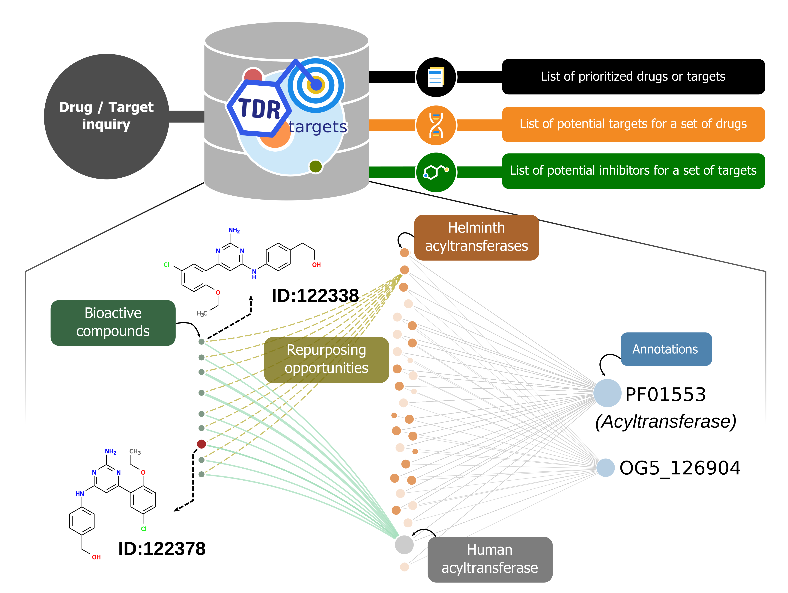
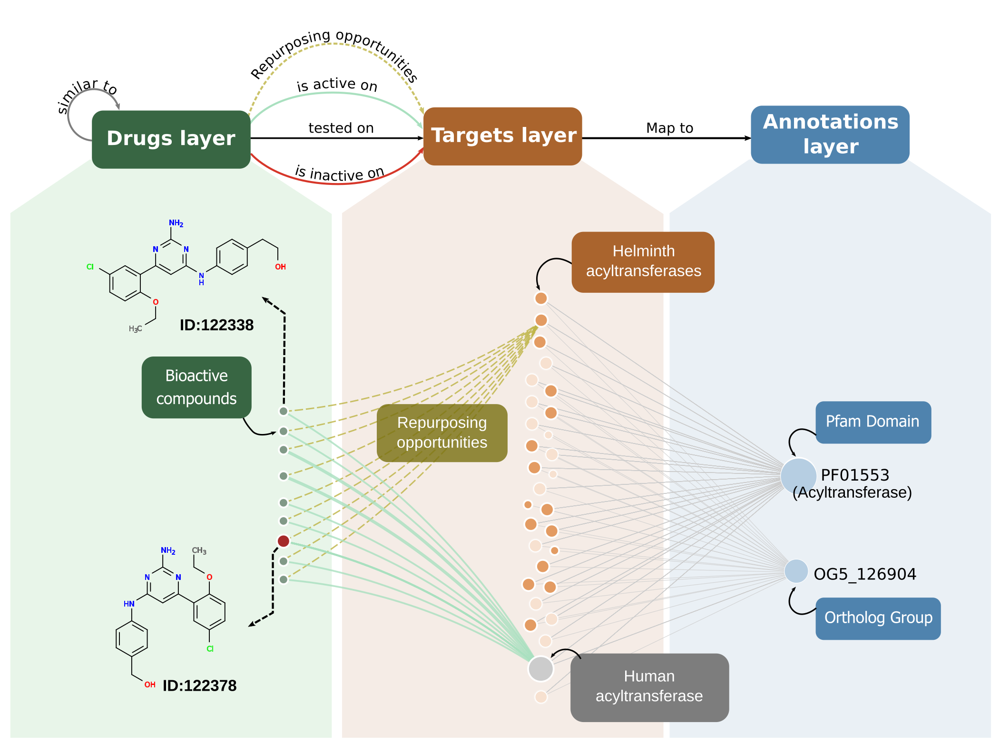
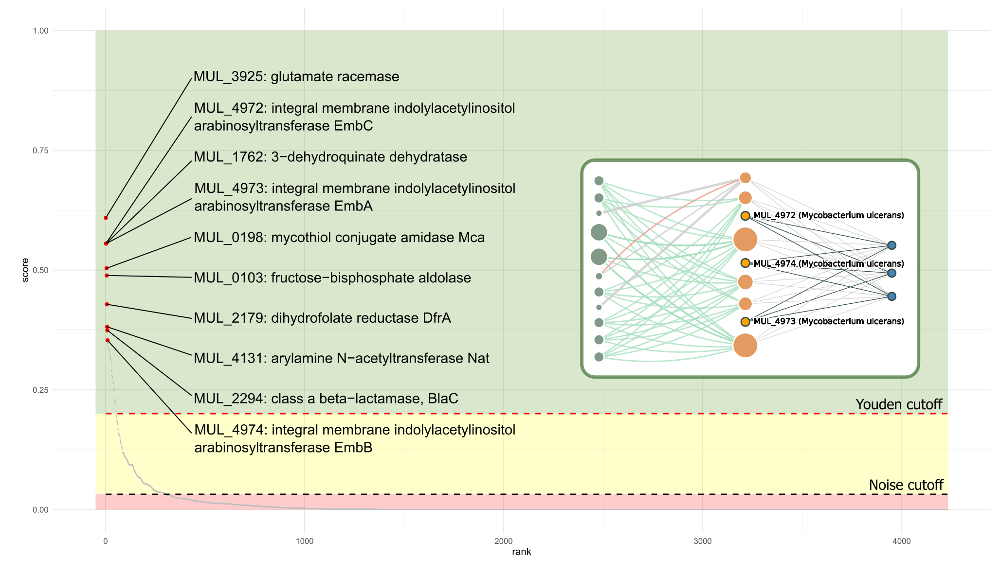
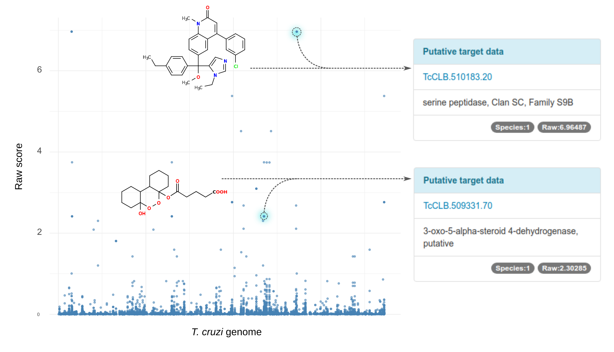

# TDR Targets: Saving the knowledge gap for neglected diseases drug discovery

## 

## Only got 2 mins?

TDR Targets  is a chemogenomic web tool that allows compound and target prioritization for drug discovery on human pathogens, particularly those causing neglected diseases. This is done through an intensive, semi-automated, chemogenomic data integration process. Integrated data is then used for the construction of a network connecting all entities (compounds, targets and annotations). The hypothesis behind this is that similar targets will be modulated by the same drugs, and similar drugs will act upon similar targets. For a quantitative analysis, an offline pre-calculation using this network allows ranking of targets according to their druggability score. Here the druggability score is based to the connections to known druggable targets. The network can also be used to rapidly spot repositioning opportunities for a given target, or suggest plausible targets for a given drug based on their similarity with drugs whose mechanism is known. The figure summarizes use case-scenarios and depicts a network subgraph built from acyltransferases (as seen in the web page), showing a possible set of repurposing candidates from human to helminth acyltransferases. 

## A full walkthrough: the TDR Targets resource (~8-10 mins)

TDR Targets is a chemogenomic web tool that allows compound and target prioritization for drug discovery on human pathogens, particularly those causing neglected diseases. This is done through the integration of both chemical a genomical data for pathogens and model organisms, which allows to perform multiple queries (A), and operations between them (B-C), to arrive to a ranked list of targets or compounds that can be exported, saved and published (E). 

While prior versions of TDR Targets already allowed these tasks, TDR Targets 6 is based on a number of upgrades that improve the user experience. These are focused in **data updates**, **Network model implementation**, **user interface upgrade** and **usability/eye-candy features**.

This post(er) will showcase all new features in TDR Targets, and provide examples of usage with plausible scenarios. 

### New data, new queries

Like in previous releases, TDR Targets serves as a knowledge base to find list of targets and compounds. This is done by querying the data and generating query collections that can be combined with each other. The list of available queries for targets and drugs are detailed below. 

#### Target Queries

<table class="table table-bordered table-hover table-condensed">
<thead><tr><th title="Field #1">Query group</th>
<th title="Field #2">Pathogens for which data is available</th>
<th title="Field #3">Data types available for querying</th>
</tr></thead>
<tbody><tr>
<td>Names &amp; Annotations</td>
<td>All</td>
<td>Gene identifiers and functional annotations (EC numbers, GO terms, Pfam domains, metabolic pathway mappings)</td>
</tr>
<tr>
<td>Protein Features</td>
<td>All</td>
<td>MW, isoelectric point, presence of predicted signal peptide, trans-membrane segments and glycosylphosphatidylinositol (GPI) anchors.</td>
</tr>
<tr>
<td>Structural Information</td>
<td>All</td>
<td>Availability of 3D structures in PDB; availability of structural models in Modbase</td>
</tr>
<tr>
<td>Gene expression</td>
<td>Plasmodium spp; Leishmania spp; Trypanosoma spp; Mycobacterium tuberculosis; Echinococcus multilocularis; Entamoeba histolytica; Toxoplasma gondii</td>
<td>Gene expression data from pathogen life cycle stages and/or experimental conditions that are relevant to drug discovery.</td>
</tr>
<tr>
<td>Phylogenetic information</td>
<td>All</td>
<td>Filter targets using simplified ‘present/absent’ in other species criteria, based on ortholog group information. Includes model organisms (human) and other related pathogens.</td>
</tr>
<tr>
<td>Essentiality</td>
<td>C. elegans (model for helminths); E. coli (model for bacteria); S. cerevisiae (model for eukaryotic pathogens); Trypanosoma brucei; Mycobacterium tuberculosis; Toxoplasma gondii; Plasmodium berghei</td>
<td>Ortholog-based inference of essentiality of genes in life cycle stages and/or experimental conditions relevant to drug discovery. Integrated from selected genome-wide gene disruption (e.g. transposon, CRISPR/Cas) and knockdown (e.g. RNAi) datasets in pathogens and model organisms.</td>
</tr>
<tr>
<td>Target Validation Data</td>
<td>Schistosoma mansoni; Leishmania major; Trypanosoma cruzi; Trypanosoma brucei; Mycobacterium leprae; Mycobacterium tuberculosis; Plasmodium falciparum</td>
<td>Manually curated data on target validation credentials (genetic, chemical and/or pharmacological, observed phenotypes)</td>
</tr>
<tr>
<td>Druggability</td>
<td>All</td>
<td>Precedent for successful chemical modulation of target activity or function. Summarized into a druggability score calculated from the network model (see main text)</td>
</tr>
<tr>
<td>Assayability</td>
<td>All</td>
<td>Available biochemical assays for protein targets (mapping based on EC numbers)</td>
</tr>
<tr>
<td>Bibliographic references</td>
<td>All</td>
<td>Filter targets based on available publications</td>
</tr>
</tbody>
</table>

#### Compound queries

<table class="table table-bordered table-hover table-condensed">
<thead><tr><th title="Field #1">Query group</th>
<th title="Field #2">Data types available for querying</th>
</tr></thead>
<tbody><tr>
<td colspan="2"><b>Text-based searches</b></td>
</tr>
<tr>
<td>Names &amp; Annotations</td>
<td>Compound names or synonyms; Database identifiers (e.g. ChEMBL, PubChem); InCHI and InCHI key identifiers</td>
</tr>
<tr>
<td>Chemical Properties</td>
<td>Molecular weight; LogP octanol/water partition coefficient; number of H donors and acceptors, number of flexible bonds and number of matching Ro5 (Lipinski)</td>
</tr>
<tr>
<td>Compound formula</td>
<td>Search by compounds containing a specific number (e.g. 3) of defined atoms (e.g. Cl, F, Br, N)</td>
</tr>
<tr>
<td>Bioactivity</td>
<td>Text search on assay descriptions; numerical search for values in assays (e.g. IC50 &lt; 5 𝛍M)</td>
</tr>
<tr>
<td>Orphan compounds</td>
<td>Search for compounds that have bioactivity reports in whole-organism or whole-cell assays but lack target and mechanism information (orphans inhibitor/drugs)</td>
</tr>
<tr>
<td>Compounds with targets</td>
<td>Find compounds that have target information and mechanism based assays</td>
</tr>
<tr>
<td colspan="2"><b>Structure-based searches</b></td>
<td> </td>
</tr>
<tr>
<td>Compound similarity</td>
<td>Draw/paste compound or fragment 2D structure and search for similar compounds. Search is based on matching of chemical fingerprints</td>
</tr>
<tr>
<td>Compound substructure</td>
<td>Draw/paste compound or fragment 2D structure and search for compounds in the database that contain the query fragment.</td>
</tr>
</tbody></table>

### The network model implementation

The network model, described originally in Berenstein et al (2016) [^1] and now fully implemented in the TDR Targets resource [^2], has two main functions: To allow sub-graph visualizations and aid on spotting repurposing opportunities (as depicted in the figure below); and to perform network-driven prioritizations. The latter, being computationally hard, are done offline. These calculations allow to determine compound-target putative interactions and to rank them according to the score obtained during the prioritization run. 

[^1]: A Multilayer Network Approach for Guiding Drug Repositioning in Neglected Diseases. Berenstein AJ, Magariños MP, Chernomoretz A, Agüero F. PLOS Negl Trop Dis. 2016 10(1):e0004300. doi: 10.1371/journal.pntd.0004300. eCollection 2016 Jan. PMID: 26735851

[^2]: TDR Targets 6: driving drug discovery for human pathogens through intensive chemogenomic data integration. Urán Landaburu L, Berenstein AJ, Videla S, Maru P, Shanmugam D, Chernomoretz A, Agüero F. Nucleic Acids Res 2019 doi: 10.1093/nar/gkz999. PMID: 31680154

### Know your druggable genome

Prioritizing a complete genome using the complex network algorithm allows users to ask an important question: What is the druggable genome for my pathogen of interest? Although the network is limited to the information with wich it was built, it is possible to determine whether a target is druggable or not based on druggability evidence for close neighbours in the network (e.g, targets sharing common, relevant annotations). The greater the amount of positive evidence for neighbours, the higher the chance the target is druggable. This allows to classify proteins into druggability groups or zones, which are depicted in the figure below as red (low probability of being druggable), yellow (medium probability) and green (high chance). Almost every target ranking into medium or high will prompt a collection of potential repositioning case-scenarios, as show in the figure for *M. ulcerans* EmbA/EmbB/EmbC proteins. 

### Find plausible targets for an orphan drugs

The same principle can be used to find potential targets for an orphan compound. These are compounds that have been shown activity in phenotypic assays, but for which their mechanism of action is yet unknown. Based on chemical similarity to neighbour compounds, the algorithm can find related drugs with known targets and rank candidates according to the distance to the orphan compound. In the figure, all *T. cruzi* orphan compounds have been analized and their putatitve target associations (x-axis) were plotted using the score obtained from network priortization (y-axis). 

### Data summary

A renewed data summary page is available for users to check out the annotation and data available for each organism in the TDR Targets database. Additionally, users can access to pathogen specific pages where orphan plots and whole-genome druggability ranking plots will be shown (along with the available data for that pathogen). Plots are interactive and can be used to browse for interesting drugs or targets. 

### Discussion & Future directions

The new data, interface and functionality of TDR6 provides users with improved navigation and visualization of targets and compounds [^2].

The current network model connects targets through affiliation of entities (proteins) to annotation concepts (Pfam domains, Ortholog groups). These have been selected based on their wide coverage and relative ease of calculation. Complementing these concepts with other important criteria for drug target validation (essentiality, expression in relevant life cycle stages) can be done by users with the tools and functionality provided by TDR6. In the future these can be built into the underlying network model itself, at least for some organisms amenable to genome-wide experimental assessment.

Several key improvements are necessary to keep TDR Targets relevant for the community of scientists working on tropical diseases. Integration of natural metabolites, and connecting these small molecules to other bioactive compounds through shared substructures or by chemical similarity will be a major focus in the future. This will allow navigating the drug-targets graph using the concepts of biochemical reactions also, which naturally connect non-orthologous enzymes through their shared substrates/products and cofactors.

There is still a large curation gap that needs to be filled. Many bioactive compounds have been tested by the community of researchers working in Neglected Tropical Diseases. Yet many of these assays and outcomes are reported in journals outside the mainstream Medicinal Chemistry journals and thus are missed by large curation efforts such as the one led by ChEMBL. Curation and integration of these missing data (including negative data!) should be a priority for the community, as it would save valuable time and resources.

