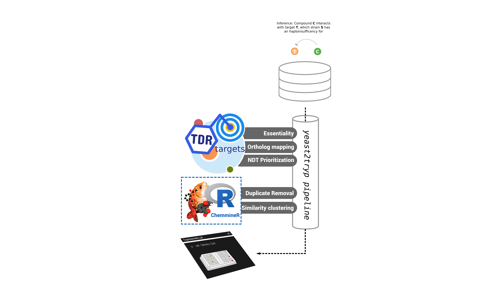

# Computational repositioning of bioactive compounds from large chemogenomic screens: identification of conserved druggable modules between yeasts and trypanosomes

## Mapping chemogenomic profiles from model organisms to trypanosomes offer new promising drug candidates for testing

### Only got 2 mins?

Detailed characterization of the cellular response to chemicals is fundamentalto understand the mechanism of action of drugs. One strategy to do this is toanalyze the growth capacity and fitness of gene mutants exposed to differentdrugs. Recently, number of genome-wide fitness profiling assays were performedon *Saccharomyces cerevisiae* [^1][^2]. These chemical-genomics screens werebased on whole-genome collections of heterozygous and homozygous deletions andquantified the growth fitness of each strain in the presence of differentchemicals. Now, several such chemogenomic datasets are available, providing arich source of pharmacogenomic associations between drugs and genes(*“druggable modules”*). In contrast, in trypanosomes pharmacogenomicassociations are scarce, hence these yeast chemogenomic screens may serve asgood starting points to guide repurposing opportunities. The aim of thisproject is the curation and standardization of yeast-based chemogenomic assaysfrom published studies, and the development of an orthology mapping pipeline tofind conserved druggable modules between yeasts and *T.  cruzi*. Using thispipeline to we obtained 93,758 gene-drug interactions, with a set of 3,005unique genes and 2,430 unique drugs.

[^1]: Systematic analysis of genome-wide fitness data in yeast reveals novel gene function and drug action. Hillenmeyer ME, *et al.*. Genome Biol. 2010i 11:R30. doi: 10.1186/gb-2010-11-3-r30. PMID: 20226027

[^2]: Mapping the cellular response to small molecules using chemogenomic fitness signatures. Lee AY, *et al.* Science. 2014 344:208-11. doi: 10.1126/science.1250217. PMID: 24723613

### A full walkthrough: the Yeast2Tryp pipeline (~8-10 mins)

A data mining pipeline was developed to extract valuable information fromchemogenomic assays on literature (~10 publications). The figure shows anexample of chemogenomic assay interpreation, which leads to a gene-drug inferred interaction. All inferences (320,428 gene-drug putative interactions)were colected and used to identify druggable modules in yeast. These modules were further mapped to *Trypanosoma cruzi* genes, allowing the identification of druggable modules conserved between the two species (3,005) and thegeneration of a new collection of inferences (83,886 putative interactions,yielding 2,430 novel compounds potentially repurposable to trypanosomes.

Further filters were applied to each set. For drugs, filters were used toretain compounds that could be mapped to compound structure and removeidentical compounds with different names or smiles; using a smiles-to-inchikey pipeline and tanimoto similarity to address possible duplications. For genes, we selected those that have *T. brucei* orthologs with significant fitness phenotypes when knocked down (whole-genome RNAi essentiality [^3]). A final filter, using network-driven prioritizations available in TDR Targets [^4], allowed the creation of a ranked list of targets. Top 10 targets were selected for further tasks. After standardization and filtering, we obtained a libraryof 218 compounds, associated with 7 candidate ortholog groups, yielding 10 different targets in *T. cruzi*.

[^3]: High-throughput phenotyping using parallel sequencing of RNA interference targets in the African trypanosome. Alsford S, *et al.* Genome Res. 2011 21:915-24. doi: 10.1101/gr.115089.110. PMID: 21363968

[^4]: TDR Targets 6: driving drug discovery for human pathogens through intensive chemogenomic data integration. Urán Landaburu L, *et al.* Nucleic Acids Res. 2019 gkz999. doi: 10.1093/nar/gkz999. PMID: 31680154

### Compounds are drug-like

We analyzed the main physicochemical properties of 218 compounds (MW, TPSA, LogP) in the Yeast2Tryp final library.  The figure shows a comparison between compounds in the library and those known to work against trypanosomes. Results show that the Yeast2Tryp library contains compounds that have similar properties to those found in known drugs.

### Multiple drugs per target

Half the compounds in the library were mapped to 1 or 2 target families, suggesting a specific mechanism of action involved; though more than one tanimoto cluster is assigned to each target. Further cheminformatic analysis is needed to address whether this clusters (despite their differences) share a common moiety or a proper scaffold. Barplots in the figure depicts the number of drug clusters assigned to each target (top-right) and the number of targets assigned for each drug in the library (bottom-right). In order to maximize the probability of working with compounds with specific modes of action, only those with 1-2 assigned clusters (green bars in the latter plot) will be considered for testing. 

For these compounds, a subgraph was created to display all putative interactions fetched for each orthology group (pink square). Some promising compound examples (green dots), are currently undergoing phenotypic assay analysis in the lab. Positive controls (found during manual curation and analysis) are also marked in these graphs (as red dots).

Interestingly, none of this targets were previously reported as druggable, meaning that there were no precedents on their chemical modulation. In the TDR Targets network, they rank as highly druggable (druggability group 3-5: thioredoxin, cytidine triphosphate synthase and casein kinase II), probably druggable (druggability group 2: Seryl-tRNA synthetase) and low probability of being druggable (druggability group 1: beta adaptin, Sec24A, Cyt C oxidase).

### A high success ratio

Manual curation of compounds, showed that ~36.42% (59) of the compounds found had already been tested in whole-cell assays against a kinestoplastid pathogen (*T. brucei, T. cruzi, L. major*), while the remaining 53.58% were novel. For the 59 compounds that had been tested, 52% (31) of them showed trypanocidal/trypanostatic activity in phenotypic assays, suggesting a good success rate (in comparison with blind screening).

### Discussion and perspectives

A repurposing pipeline was built using chemogenomic data from yeast. This pipeline integrates data from different sources (chemogenomic data, orthology mappings, essentiality, etc) and, in principle, it could be re-used for any collection of data.  

Interestingly, manual curation of compounds suggests that the likelyhood of finding a compound with trypanocide activity is very high (50%) using this strategy.  Unfortunately, however, for most positive controls (those compounds found tested & active) it was impossible to say whether the mechanism of action is through the genes suggested by this pipeline or through a completely different one. 

Additional cheminformatic analysis should be done to address if all compounds mapped to a given target share a particular moiety or scaffold. This could be informative to determine whether the mode of action is target-specific or not. 

Further assays are required not only to validate the strategy but also to find promising candidates for lead compound development. 
