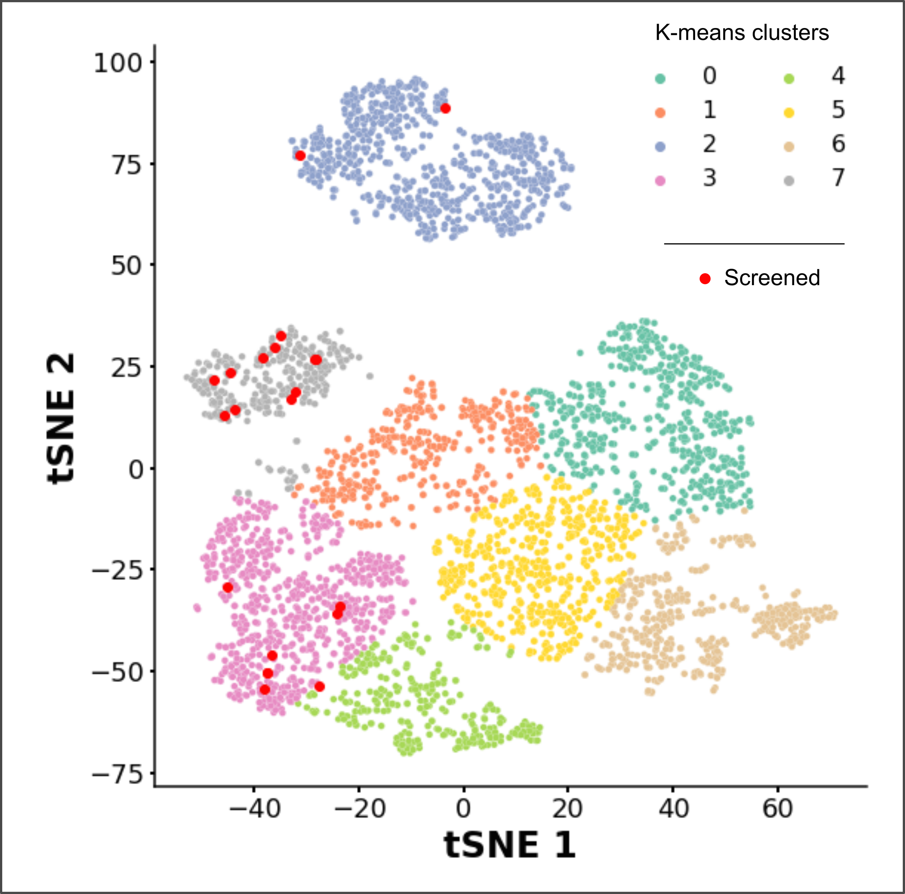
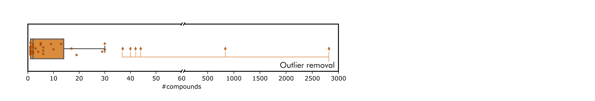
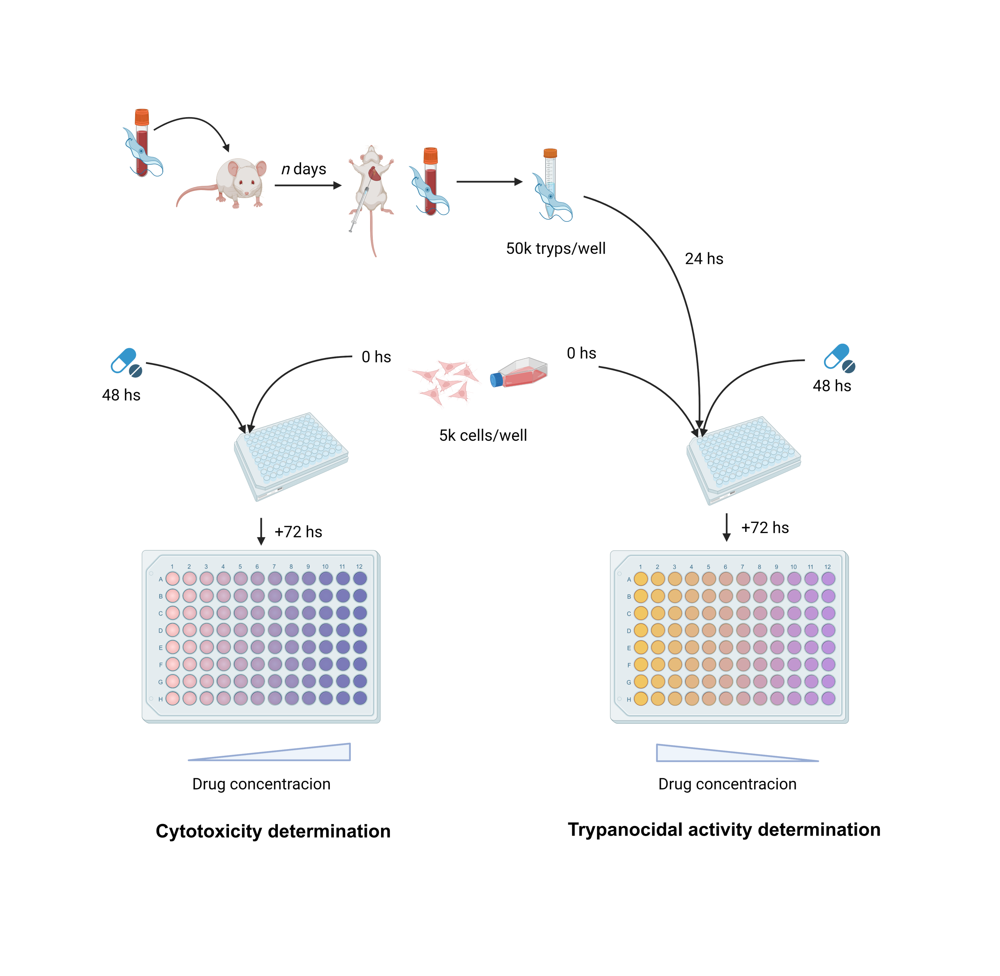

## Only got two mins?

The drug repurposing approach to drug discovery for neglected diseases has shown to be effective to find potential therapeutic agents. For Chagas disease, in particular, with some of these agents even making it to clinical trials. We have shown that a programmatic approach for drug repurposing, using intensive chemogenic data integration strategies, can recall known bioactive compounds and druggable targets for a selected pathogen species, and can also recommend novel drug-target pairs for further experimental validation (Berenstein et al, 2016).

In this work, we used the TDR Targets database (Landaburu et al, 2020) for target prioritization and drug recommendation, followed by a filtering pipeline addressing compound novelty, commercial availability and functional groups. As a result we obtained  18 compound libraries, each one collecting compounds with a different known active pharmacophore. In this work two libraries were selected for manual curation and further analysis: one library containing 28 piperazines, and another one containing 15 nitro-compounds). Out of a total of 43 compounds, 22 were acquired for experimental validation.

Trypanocidal activity of these compounds was determined in-vitro against T. cruzi amastigotes growing in Vero cells, using Tulahuen parasites expressing a bacterial LacZ beta-galactosidase gene (Buckner 1996), incubating cultures with drug-supplemented (20 µM) RPMI media over 96 hs, and measuring ꞵ-gal activity as a proxy for parasite growth. Compound cytotoxicity was assessed in uninfected Vero cells by resazurin assay with similar drug concentrations.

From this primary screening, 5 compounds displayed promising results, with good trypanocidal activity, and low/no cytotoxicity. An additional set of 4 compounds killed both host cells and parasites and thus should be assayed in lower concentrations to determine selectivity. All 9 compounds will be investigated further.

## Full Walkthrough

### Dataset exploration and analysis

TDR Targets is a powerfull knowledge base that has recently incorporated novel ways to prioritize targets and drugs (Landaburu et al, 2020). This comes in handy when building screening libraries, as it allows not only for target selection but also for compound expansion using graph algorithms. This means that, for any target of interest, one may find known inhibitors based in evidence obtained for other organisms) and structurally similar compounds, based in network calculations of proximity and relevance (Berenstein et al, 2016).

In this work we prioritized _Trypanosoma cruzi_ targets using the Network Druggability Score (>= 4). From the list of prioritized targets (327 genes), a set of compounds was obtained using TDR Targets transformation queries. From then on, data was exported to CSV an processed further. Out of 180023 drugs in the dataset, 622 had already been tested, 1879 were found in a DrugBank dataset (all compounds, current and withdrawn), with only 82 compounds in both tested and DrugBank datasets; leaving a total of 1797 untested compounds in the DrugBank set. However, most of these compounds were not commercially availabe (in pure form) and were thus unsuitable for screening library preparation.

The commercial availability of compounds is a big problem when creating repurposing libraries. To quantitatively address this issue, we ran API searches for all 180023 compounds against [Molport](http://molport.com) and found only 28.802 (~15%). This poses a great inconvenience, as it means 85% of prioritized compounds chosen for a given library may not be easy to acquire. With this in mind, all libraries mentioned downstream were built using the 28.802 compounds found in Molport.

Targets in the dataset were further filtered by selecting only those annotated as part of _Energy uptake_ and _Ammionacid metabolism_ metabolic pathways, reducing the number of total genes (327) to about 10% (44). This was an informed decision, based in the evidence of exacerbated Carbon Metabolism observed in amastigote infected cells (Shah-Simpson et al 2017) and the role of some amminoacids (and intermediate metabolites) in parasite survival through infection (Marchese et al 2018). After this selection, the remaining number of compounds was 4041.

### Library conformation & analysis

A tSNE analysis followed by k-means clustering was conduncted to find patterns amongst physicochemical properties and structural smiliarities that may help with the selection of compounds later on. The tSNE distribution shows a broad diversity of exploration of the chemical space, while the k-means, even with a vast exploration of k (ranging from 2 to 500), was not of any use for compound seggregation (other than visual aesthetics). Since the origins of the dataset are quite diverse, a hierarchical clustering with single linkage was done to create micro-clusters possibly containing compound series.

Out of all tested compounds found in TDR Targets and the literature, a series of scaffolds were consistently seen present in compounds with trypanocide activity. Using these scaffolds, small libraries were put together. The possible mechanism of action for this scaffolds was neither analyzed nor taken into consideration when building the libraries.

|Author                    |Year              |#Compounds|Scaffold          |
|--------------------------|------------------|----------|------------------|
|Huang                     |2016              |37        |benzamidine       |
|Chohan                    |2013              |40        |sulfonamide       |
|Docampo                   |2007              |7         |indole            |
|Ciammaichella             |2020              |31        |piperazine        |
|Rupak                     |2016              |30        |morpholine        |
|Lancaster                 |2015              |91        |azole             |
|Lancaster                 |2015              |49        |thiazole          |
|Da Rosa                   |2022              |19        |oxazole           |
|Zuma                      |2017              |12        |furan             |
|Ganapaty                  |2006              |2         |napthalene_diimide|
|Batista Jr                |2008              |9         |chromenes         |
|Lancaster                 |2015              |16        |benzothiazole     |
|Silva-Junior              |2016              |1         |thiazoleidine     |
|Soares                    |2012              |8         |adenine           |
|Moares                    |2014              |16        |nitro             |

> The table above has the number of compounds found with each scaffold and the latest found literature referring such scaffold in compounds with demonstrated activity against _T. cruzi_.

Prior to the creation of libraries, and based in the observations derived from the compound set characterization, drug an target outliers (targets with too many associated compounds and vice-versa) were removed from the set. After outlier removal, the total number of compounds was inherently reduced to 385.

### Compound purchase

A total of 21 compounds were acquired, 12 from the nitro library and 9 from the piperazine library. Despite sharing a common scaffold, and being somewhat closely clustered in tSNE analysis, addtional functional groups in each molecule make for a very diverse library, as it can be seen in the network depiction of the library.

Graph visualization of compounds (green) connection with known (grey) and putative (orange) targets can be seen to the left. Filled compound nodes were acquired for experimental validation.

### Experimental validation

#### In-vitro determination of trypanocidal activity

To determine the compounds’ trypanocidal activity, a colorimetric assay was set up using transgenic _T. cruzi_ Tulahuen parasites expressing bacterial β-galactosidase (LacZ), using enzyme activity (degradation of Chlorophenol red-β-D-galactopyranoside, CPRG) as a proxy for parasite growth. To this end, 5x104 purified trypomastigotes/well were used to infect previously seeded (24 hs earlier) Vero cells, into a 96-well plate at 5x103 cells/well. After 24 hours of infection, cultures were thoroughly washed with PBS to remove free trypomastigotes and fed with compound supplemented (20 uM) RPMI media without phenol red (Gibco #11835030). Benznidazole (BNZ), also at 20 uM, was used as a positive control, along with DMSO (0.5%) for carrier control, and infected/untreated and non-infected/untreated controls for assay’s maximum and minimum β-gal activity expected measurements. Both compounds and controls were tested with duplicates. 

After culture incubation with 20 uM compound for 96 hs, 100 uL of a freshly prepared solution containing 1% NP40 and 100 uM CPRG (Roche #10884308001) was added to each well, to a final concentration of 0.5% and 50 uM, respectively. Plates were then incubated for 4 hours in the stove and kept from light throughout the incubation. Finally, β-gal activity was determined by absorbance reading at 595 nm in a plate reader (FilterMax F5 Multimode Microplate Reader, Molecular Devices).

#### In-vitro determination of cytotoxicity

For cytotoxicity, a resazurin (RZ) assay using the same compound concentrations was conducted on non infected Vero cell cultures. The cells were seeded at 5x103 cells/well, cultured for 48 hs, washed with PBS, fed with compound supplemented (20 uM) RPMI fresh media and incubated for 96 hs. Afterwards, 10 uL of freshly prepared RZ 10X solution was added to each well. BNZ (20 uM) and DMSO (0.5%) controls were also added to this assay, along with an untreated cells control and a no-cells control for maximum and minimum reagent reduction readings. A 100% reduced RZ control (1X autoclaved RZ solution in RPMI media) was added to the plate as a means to determine when to take the final reduction reading: absorbance readings at 600 nm were taken each hour until the untreated cells control reached the 100% reduced RZ control readings. The final reading was taken after 7 hours of incubation, where absorbance at 600 nm and 570 nm was taken. All measurements were done using the same plate reader (FilterMax F5 Multimode Microplate Reader, Molecular Devices). Compounds and controls were tested with duplicates.

### Hit selection

Compounds with low CPRG reads at 595 nm and high % Reduction were considered straight hits. Those with both low CPRG reads and low % Reduction remain to be re-tested at lower concentrations. For CPRG assay, the threshold was determined as the CPRG readout for the non infected control plus 3 times the standard deviation for such measurement (0.2084). For Resazurin, the threshold was abritrarily set to 35%. Plotting both measurements, along with these thresholds, allows for rapid identification of hits.

## Discussion

Hits found during screening assays (★) were present as well in the morpholine (1855308), benzamidine (2141063) and azole (2141063 as well) libraries. Interestingly, most hits come from the k-mean cluster #7, which may suggest a structural/physicochemical trend worth exploring further, possibly related to nitro and benzamide functional groups.

The putative targets associated with these compounds are completely novel targets (none of them sufficiently explored to assess whether target validation is feasible). These targets are TcCLB.510329.90 (C-8 sterol isomerase), TcCLB.509287.50 (Glucose-6-P 1-dehydrogenase), TCCLB.506489.20 (Monoglyceride lipase) and TcCLB.506025.60 (2-oxoglutare dehydrogenase / dihydrolipoamide succinyltransferase).