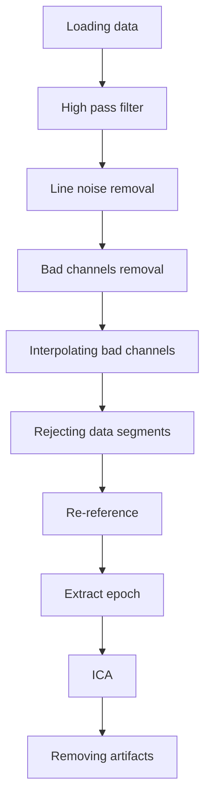

 {}
This is an ongoing project.
{}

```mermaid
graph TD;
  A[Loading data]-->B[High pass filter];
  B[High pass filter]-->C[Line noise removal]; 
  C[Line noise removal]-->D[Bad channels removal];
  D[Bad channels removal]-->E[Interpolating bad channels];
  E[Interpolating bad channels] --> F[Rejecting data segments];
  F[Rejecting data segments] --> G[Re-reference];
  G[Re-reference] --> H[Extract epoch];
  H[Extract epoch] --> I[ICA];
  I[ICA] --> J[Removing artifacts];
```


