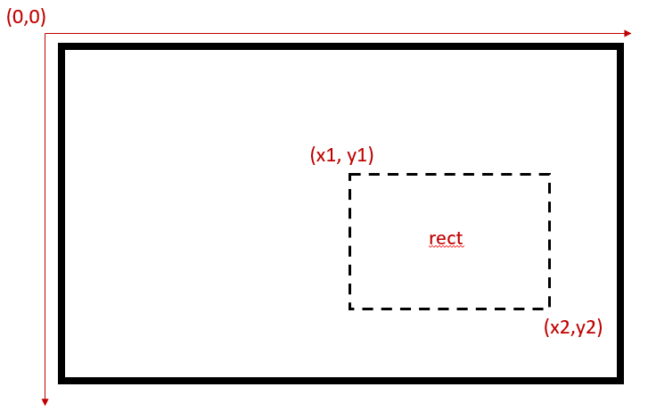

## TL;DR
使用[x1,y1,x2,y2]指定圖片出現的位置，其中(x1,y1)是圖片呈現區塊(rect)的左上角坐標，(x2,y2)是右下角坐標。

```python
img = imread('img.png'); 
Texture = Screen('MakeTexture', window, img);
rect = [x1, y1, x2, y2];
Screen('DrawTexture', window, Texture, [], rect);
Screen('Flip', window);
WaitSecs(2);
```
## 使用Psychtoolbox呈現圖片
要使用Psychtoolbox呈現一張圖片，我們首先需要使用`imread()`將圖片載入內存，接著用`Screen('Make Texture')`將圖片矩陣轉化成Psychtoolbox需要使用的紋理(texture)。在圖片出現之前，我們需要使用`Screen('Draw Texture') `提前在背景渲染好圖片，最後使用`Screen('Flip')`把背景中的圖片“翻”到熒幕上。

1. 讀取圖片檔案
```python
img = imread('img.png'); 
```
使用Matlab自帶的[`imread()`函式](https://www.mathworks.com/help/matlab/ref/imread.html)載入圖像，載入後為一個3維矩陣: 高 x 寬 x 色彩（RGB)。

我遇到過載入一張黑白PNG圖片檔結果出現一個2維矩陣的情形，因為函式把它當做是灰階圖片，所以格式稍有不同。這種情況在後面一步會報錯，所以需要下面的程式碼將其調整為常見的三維矩陣格式。這段程式碼是把png圖片的alpha通道手動合併到生成的矩陣中補齊缺少的色彩資料，從而解決上述問題。

```Python
[img, cm, transparency] = imread('img.png');
puzzle0 = cat(3, img, transparency);
```

2. 把圖片矩陣轉化為紋理

Psychtoolbox是基於OpenGL的工具，需要用到其中的紋理(texture)。
我們只需要使用`Texture = Screen('MakeTexture', window, img)` 把上一步生成的三維矩陣轉化成紋理，儲存到自訂的變數中即可。

3. 將紋理載入緩存中

為了保證圖片呈現的速度，Psychtoolbox會將要呈現的圖片載入緩存中，我們可以理解為提前在一塊備用畫板上畫好圖片，這樣最後直接拿出來的速度會比需要用到時當場畫出來更快。這一步需要使用`Screen('DrawTexture')`函式。
```Python
Screen('DrawTexture', window, Texture, [], rect);
```
這一步我們需要提供至少3個參數。window是Psychtoolbox初始化時設定的窗口物件，也就是告訴函式需要呈現圖片的目標窗口，而texture是上一步設定的紋理物件。這兩個參數告訴函式需要將哪個圖片紋理繪製在哪個窗口（熒幕）上。

 還有一個`rect`參數是這篇文章的關鍵。它規定的是最後圖片要呈現的位置。它是一個1 x 4的矩陣，參考下節具體說明。如果這邊不給定一個位置(可以留一個空矩陣`[]`)，圖片會被默認呈現在熒幕中間的位置。 

4. 呈現圖片
最後一步語句告訴程式是時候讓圖片出現在熒幕中了，直觀的理解是程式把剛才準備的備用畫板“翻”到主熒幕上，因為圖片已經提前畫好，直接翻面的速度會比收到命令後再繪製快，這細微的速度差異是高精度心理物理學實驗中十分重要的。
```Python
Screen('Flip', window);
WaitSecs(2);
```
`WaitSecs(2)`語句告知程式等待兩秒再下一步，在這邊是避免圖片一閃而過結束程式。

## Rect: 圖片出現的位置

在使用`Screen('DrawTexture')`時，我們需要給出圖片出現的區塊(rect)。它是一個熒幕上的方形區域，可以通過左上角和右下角的坐標規定其位置。



坐標系的起點(0,0)是熒幕的左上角。一般為了防止給出的坐標太大超過熒幕的範圍（此時圖片不會出現在熒幕上，但程式不會報錯)，我們可以使用
`[screenXpixels, screenYpixels] = Screen('WindowSize', window);`來獲取熒幕x軸和y軸的像素點數量，在設計程式的時候需要注意不超過這個範圍。當然，同一個熒幕根據解析度設定不同，這個數值也會改變，需要特別注意。

 這邊有一個建議，為了避免自己和實驗室的熒幕解析度不一樣導致實驗中圖片歪掉的尷尬情況，我會盡量避免使用固定的像素值來規定坐標。假如我想把圖片呈現在熒幕中間，對於1080P的熒幕(1920 x 1080解析度)，絕對坐標會是 x = 960, y = 540，而所謂相對坐標則可以用x = 水平像素點的一半, y = 垂直像素點數量的一半。這樣的好處是，如果實驗室的熒幕解析度為1280 x 768, 使用絕對坐標會讓圖片出現在偏右下角的位置，如果熒幕解析度更小更可能會直接消失，而使用相對坐標則避免了這個問題。

還有一個問題是區塊的尺寸。你可以隨便指定一個尺寸，就算圖片的高寬比和大小與你指定的區塊不一樣，Psychtoolbox也不會報錯，而是會縮放圖片將其塞入區塊中。但因為用的是不鎖定高寬比的縮放方式，圖片可能會變形影響呈現，所以建議在指定rect大小的時候將圖片的尺寸或高寬比考慮在內。假如我希望圖片能夠以原大小出現在熒幕上，我可以記錄圖片的高(image_height)寬(image_width)，並這樣規定區塊`[X_top_left, Y_top,left, X_top_left + image_width, Y_top + image_height]`。


## 使用中點的坐標定位區塊
實務上我傾向於使用另一種方法定義區塊的位置。前面所述的方法需要給定2個坐標，在計算上比較繁瑣。Psychotoolbox自帶了[許多函式](http://psychtoolbox.org/docs/PsychRects)讓我們能操作區塊。其中一個函式能把區塊居中到一個點上(`newRect = CenterRectOnPoint(rect,x,y)`)。所以我們可以隨便指定一個區塊（方便起見，我一般設為[0,0,image_width,image_width]),然後找到一個坐標，讓臨時區塊以這個坐標為新的中點。

在下列程式碼中，我在熒幕左上角創建了一個 100 x 100 的臨時區塊，然後將其移動到中點為(500,500)的區域上。
```Python
rect = [0,0,100,100];
newRect = CenterRectOnPoint(rect, 500,500);
```
這一行程式碼的效果和建立一個[450, 450, 550, 550]的區塊是一樣的，但這時我就不必根據圖片的大小和熒幕解析度去計算左上角和右下角的坐標，只需要知道最終出現位置的中點和想呈現的大小。
