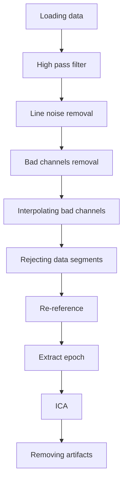

 {}
This is an ongoing project.
{}

I remember the first time I learnt EEG preprocessing. It was like learning how to cook a dish. By following a recipe, you'll learn the ingredient needed and the amount you need, but seldom does the recipe tell you why is such an ingredient necessary and how to decide the exact amount needed. 

It might not be a huge issue if you miss some ingredient or add some of your personal flavors while cooking. However, it matters as a researcher that you justify the preprocessing steps used in your pipeline, and decide the right function parameters. 

